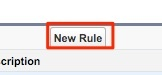

# Använda fältet Anpassat intäktsbelopp {#using-a-custom-revenue-amount-field}

Som standard hämtar Buyer Attribution Touchpoints säljprojektsbeloppet från ett av två fält:

* Belopp (SFDC-standard)
* [!DNL Marketo Measure] Affärsmöjlighet (anpassat)

Om du använder ett anpassat beloppsfält för dina affärsmöjligheter måste vi konfigurera ett arbetsflöde för att kunna beräkna Buyer Touchpoint-intäkterna. Detta kräver mer avancerade kunskaper om [!DNL Salesforce]så det kan behöva hjälp av SFDC-administratören.

Vi behöver följande information:

* API-namn för beloppsfältet

Här börjar vi skapa arbetsflödet.

## Skapa arbetsflödet i Salesforce Lightning {#create-the-workflow-in-salesforce-lightning}

Följande steg gäller för Salesforce Lightning-användare. Om du fortfarande använder Salesforce Classic, de stegen [anges nedan](#create-the-workflow-in-salesforce-classic).

1. Skriv &quot;Flöden&quot; i rutan Snabbsökning under Konfigurera och välj **[!UICONTROL Flows]** för att starta Flow Builder. Klicka på **[!UICONTROL New Flow]** -knappen.

   

1. Välj **[!UICONTROL Record-Triggered Flow]** och klicka **[!UICONTROL Create]** längst ned till höger.

   

1. Välj objektet säljprojekt i fönstret Konfigurera start. Från [!UICONTROL Configure Trigger] avsnitt, markera **[!UICONTROL A record is created or updated]**.

   

1. I avsnittet Ange villkor, under [!UICONTROL Condition Requirements], markera **[!UICONTROL Custom Condition Logic Is Met]**.
   * Välj ditt anpassade beloppsfält från sökfältet.
   * Ange operatorn som **Är null** och värdet som **[!UICONTROL False]**.
   * Ange utvärderingskriterierna till **[!UICONTROL Every time a record is updated and meets the condition requirements]**.

   

1. Under avsnittet Optimera flödet för väljer du **[!UICONTROL Fast Field Updates]**. Klicka **[!UICONTROL Done]** längst ned till höger.

   

1. Om du vill lägga till elementet klickar du på plusikonen (+) och väljer **[!UICONTROL Update Triggering Record]**.

   

1. Ange följande i fönstret Ny uppdatering av poster:

   * Ange en etikett - API-namnet genereras automatiskt
   * Under &quot;How to Find Records to Update and Set their values&quot; väljer du **[!UICONTROL Use the opportunity record that triggered the flow]**.
   * I dialogrutan[!UICONTROL Set Filter Conditions]&quot; väljer du **[!UICONTROL Always Update Record]** som ett villkorskrav för att uppdatera posten.
   * I &quot;[!UICONTROL Set Field Values for the Campaign Record],&quot; från fältet väljer du Marketo Measure-säljprojektsbelopp och från-värde. Välj sedan det anpassade mängdfältet.
   * Klicka på **[!UICONTROL Done]**.

   

1. Klicka på **[!UICONTROL Save]**. Ett popup-fönster visas. Skriv Flow Label i fönstret Save the Flow (Flow API Name will be generated automatically). Klicka **[!UICONTROL Save]** igen.

   

1. Klicka på **[!UICONTROL Activate]** för att aktivera flödet.

   

## Skapa arbetsflödet i Salesforce Classic {#create-the-workflow-in-salesforce-classic}

Följande steg gäller för Salesforce Classic-användare. Om du har gått över till Salesforce Lightning, de här stegen [finns ovan](#create-the-workflow-in-salesforce-lightning).

1. Navigera till **[!UICONTROL Setup]** > **[!UICONTROL Create]** > **[!UICONTROL Workflow & Approvals]** > **[!UICONTROL Workflow Rules]**.

   

1. Välj **[!UICONTROL New Rule]**, ange objektet som säljprojekt och klicka på **[!UICONTROL Next]**.

   

   

1. Konfigurera arbetsflödet. Ange regelnamnet &quot;Uppdatera [!DNL Marketo Measure] Belopp för affärsmöjlighet.&quot; Ställ in utvärderingsvillkoren på&quot;Skapad och varje gång den redigeras&quot;. För regelvillkoret väljer du det anpassade mängdfältet och sedan Operator [!UICONTROL as "Not Equal To"] och lämna fältet&quot;Värde&quot; tomt.

   

1. Lägg till en arbetsflödesåtgärd. Ange den här listan som &quot;[!UICONTROL New Field Update].&quot;
   

1. Här fyller du i fältinformation. I fältet &quot;Namn&quot; rekommenderar vi att du använder följande namn: &quot;[!DNL Marketo Measure] Opp-belopp.&quot; &quot;Unikt namn&quot; fylls i automatiskt baserat på fältet &quot;Namn&quot;. Välj &quot;[!DNL Marketo Measure] Belopp för affärsmöjlighet.&quot; När du har markerat fältet markerar du rutan &quot;Utvärdera arbetsflödesregler igen efter fältändring&quot;. Välj &quot;Använd en formel för att ange det nya värdet&quot; i rutan &quot;Ange nytt fältvärde&quot;. Släpp API-namnet för det anpassade beloppsfältet i den tomma rutan. Klicka på **[!UICONTROL Save]**.

   

1. kommer du tillbaka till en startsida för ditt arbetsflöde, se till att&quot;Aktivera&quot; så är du redo att gå. Aktivera genom att klicka **[!UICONTROL Edit]** bredvid ditt nya arbetsflöde och klicka sedan på **[!UICONTROL Activate]**.

   När du har slutfört de här stegen måste du uppdatera affärsmöjligheterna för att få det nya värdet från [!UICONTROL custom opportunity] fält.

   Detta kan uppnås genom att du kör dina affärsmöjligheter via Data Loader i SFDC. Hitta information om hur du använder datainläsaren i [den här artikeln](/help/advanced-marketo-measure-features/custom-revenue-amount/using-data-loader-to-update-marketo-measure-custom-amount-field.md).

Om det finns några frågor längs vägen går det bra att kontakta kontogruppen på Adobe (din kontoansvarige) eller [[!DNL Marketo] Support](https://nation.marketo.com/t5/support/ct-p/Support){target="_blank"}.
