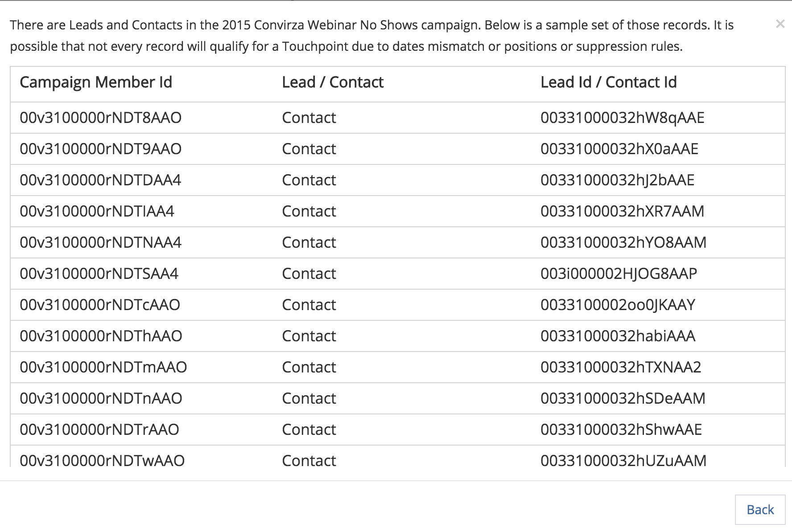

# Synkronisering av anpassad kampanj {#custom-campaign-sync}

Idag, med [!DNL Marketo Measure] kan ni ange vilka kampanjer som ska ingå som en kvalificerad kontaktyta. Det finns många hinder för detta som det var tidigare. När [!DNL Marketo Measure] paketet är installerat i CRM. Det kan ta tid att godkänna det av säkerhetsteamet. Det finns dessutom bristande flexibilitet när det gäller att använda en enda plocklista i Campaign-objektet. Med den här nya funktionen krävs ingen paketinstallation för att börja använda poster för Campaign- och Campaign-medlemmar. Regler kan skapas för att definiera exakt vilka poster som kan skapas för att definiera exakt vilka poster som är kvalificerade.

## Krav {#requirements}

* Kampanjsynkronisering finns i alla nivåer
* För att kunna importera data måste du fortfarande ansluta CRM till [!DNL Marketo Measure] konto

## Så här fungerar det {#how-it-works}

1. Med behörigheten AccountAdmin kan du navigera till **[!UICONTROL Settings]** > **[!UICONTROL Campaigns]** och se gränssnittet för reglerna för synkronisering av kampanjmedlemmar.
1. Klicka på **+** om du vill börja skapa en regel.

   

1. Du kan skapa en regel från [!UICONTROL Campaign] eller [!UICONTROL Campaign Member] fält. Fyll i resten av regeln med operatorn och värdet som vi förväntas validera. I exemplet nedan söker vi efter en viss kampanj efter namnet.

   

   >[!NOTE]
   >
   >Formelfält kan inte användas i reglerna och visas inte i plocklistan. Eftersom formler beräknas i bakgrunden och inte ändrar en post, [!DNL Marketo Measure] kan inte identifiera om en post passar en regel eller inte.

1. Välj slutpunktsdatum. Listan över möjliga datum visas när du har angett klammerparenteser `{` - kan du välja vilket datum du vill använda för alla kontaktpunkter som skapas från regeln.

   

   >[!NOTE]
   >
   >Om du använder anpassade regler för kampanjsynkronisering [!DNL Marketo Measure] kommer inte att läsa några uppdateringar som du har gjort med knappen Kontaktpunktsdatum för gruppuppdatering.

1. Klicka på bockmarkeringen och lägg sedan till ytterligare regler för ytterligare kampanjer efter behov.

   

   >[!NOTE]
   >
   >Nu när reglerna definieras tillsammans med CRM-synkroniseringen börjar de angivna reglerna naturligtvis att hamna i konflikt. Om du väljer att fortsätta använda både den anpassade kampanjsynkroniseringen _och_ I CRM-synkroniseringstypen är det viktigt att skapa regler så att CRM-synkroniseringstyperna inte ignoreras.

   

   >[!NOTE]
   >
   >Om du funderar på att så småningom stoppa användaren av [!UICONTROL CRM Sync Type]är det idealiskt att skapa regler som inte refererar till &quot;Synkroniseringstyp&quot;, men _stilla_ upprätthålla aktuella CRM-kontaktytor. På så sätt fungerar reglerna fortfarande om/när den ändringen görs.

Här är ett exempel på hur det skulle se ut, så att inga befintliga CRM-kontaktytor försvinner:

## Validering {#validation}

Du kan enkelt kontrollera Touchpoints- och Buyer Attribution Touchpoint-posterna i Campaign för att se till att reglerna fungerar som de ska. Här är en BAT som [!DNL Marketo Measure] som skapats med lämpligt dynamiskt slutpunktsdatum, hämtat från kampanjen. Fältet Skapat den finns i bilden nedanför det.

## Testning {#testing}

1. Funktionen Kampanjsynkronisering innehåller en testfunktion så att du kan kontrollera om reglerna som du har skapat verkligen uppfyller Campaign-villkoren. Börja med att klicka på [!UICONTROL Test] -knappen. Reglerna måste sparas innan du kan börja testa.

   

   Ett popup-fönster visas där du kan ange ett kampanj-ID (15 eller 18 tecken från CRM) att testa. Poängen är att ange det kampanj-ID från CRM som du försökte synkronisera för att se till att det matchar regeln som du skapade.

   

1. När du klickat [!UICONTROL Test]ser du namnet på Campaign och antalet Campaign-medlemmar som är berättigade till kontaktytor. En tabell visas nedan som visar alla regler som matchar ditt kampanj-ID. Endast matchningarna visas.

   

1. Du kan också klicka på medlemsantalet för att visa en lista över de leads och kontakter och deras ID:n som ingår i kampanjregelns berättigande. Detta är bara en exempeluppsättning som visas upp till 50 så att du kan få en uppfattning om vilka poster som är kvalificerade.

   
