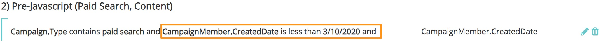

# Synkroniserar historiska data {#syncing-historical-data}

[!DNL Marketo Measure] är en lösning som innehåller de mest detaljerade, åtgärdbara data. Vi förstår dock att du kan ha befintliga data som du vill ha attribuering för. Det går att generera kontaktytor för historiska data, men det är viktigt att ta hänsyn till några faktorer innan du går vidare med den här processen.

>[!NOTE]
>Den här artikeln handlar om en föråldrad process. Vi uppmuntrar användare att använda den [nya, förbättrade processen i appen](/help/channel-tracking-and-setup/offline-channels/custom-campaign-sync.md){target="_blank"}.

## Faktorer att tänka på {#factors-to-consider}

**Är data redan organiserade i kampanjer?**

a. Data måste ordnas i kampanjer för att kunna synkroniseras med [!DNL Marketo Measure] för att Touchpoints ska kunna genereras. Om det inte är organiserat i kampanjer just nu vill ni utvärdera om det är värt den tid och de resurser som behövs för att segmentera data i lämpliga kampanjer.

b. Det datum då medlemmen lades till i kampanjen eller markerades som svarad kommer att användas för slutpunktsdatumet, så detta måste också vara korrekt. [!DNL Marketo Measure] erbjuder tillfälliga lösningar i både SFDC och MSD för att uppdatera datumen, men detta kan ta lång tid beroende på volymen.

**Har du en ganska lika mängd data organiserade i kampanjer för alla kanaler (betalsökningar, händelser, organiska osv.)?**

Det är viktigt att ha en balanserad bild av attribueringen för att få korrekt och&quot;rättvis&quot; rapportering. Om du t.ex. bara har data för tidigare offlinekanalarbete som Händelser, kommer data i sig att vara partiska utan historiska onlinedata för att komplettera dem.

**Vilken nivå av granularitet väntar du?**

Du kommer i princip bara att kunna namnet Kanal, Delkanal och Campaign.

**Vilka är dina rapporteringsmål i framtiden?**

Dessa data kommer att begränsas, så det är viktigt att tänka på hur du tänker använda dem. Det kanske inte är så klokt att jämföra historiska data med framtida data.

**Hur långt bak vill du gå?**

[!DNL Marketo Measure] rekommenderar starkt att du inte går längre än det föregående året.

Det här är ett ämne som vi rekommenderar starkt att du diskuterar med din [!DNL Marketo Measure]-kontakt först. Om du har övervägt ovanstående och vill fortsätta, visas allmänna instruktioner (separat för [!DNL Salesforce] och [!DNL Microsoft Dynamics]) nedan.

## Synkroniserar tidigare kampanjer i [!DNL Salesforce] {#syncing-historic-campaigns-in-salesforce}

**Online:**

Om du vill synkronisera historiska onlinedata måste data ordnas i Salesforce Campaigns som du sedan synkroniserar till [!DNL Marketo Measure] via [!DNL Salesforce] Kampanjsynkroniseringsregler i appen [!DNL Marketo Measure]. Det är viktigt att se till att kontaktytor inte genereras från någon av dessa kampanjer efter det datum då din JavaScript publicerades. Orsaken till detta är att undvika dubbla kontaktytor. När JavaScript finns tillgängligt spåras onlineinsatserna automatiskt, så vi vill inte heller spåra dem via en SFDC-kampanj. För att undvika det här problemet måste du lägga till en tidsuppfattning i regeln. Kanske något som &quot;Skapad av kampanjmedlem&quot; är mindre än [JavaScript publiceringsdatum]&quot;.

Kanalmappningskomponenten för historiska onlinedata kan vara lite besvärlig. Vi vill att den ska matcha dina nuvarande regler för onlinekanaler (från regelbladet online) så nära som möjligt för ren rapportering. Nedan visas ett exempel på en perfekt kanalmappning.

>[!NOTE]
>Den här kanalmappningen görs i avsnittet [!UICONTROL Offline Channels] i appen [!DNL Marketo Measure] eftersom vi använder SFDC-kampanjer.

| Salesforce Campaign Type | Kanal | Delkanal |
|---|---|---|
| Betalsökning - AdWords | Betalsökning | AdWords |
| Betalsökning - Bing | Betalsökning | Bing |
| Betald sökning - Yahoo | Betalsökning | Yahoo |

Onlinedata som läggs till på det här sättet är i sig mindre detaljerade än onlinedata som [!DNL Marketo Measure] spårar via JavaScript. Till exempel kommer fält som formulär-URL, landningssida, referenssida osv. inte att fyllas i. Därför rekommenderas att kampanjerna delas upp i varje källa om möjligt. Som du ser i exemplet ovan måste du ha flera Campaign-typer för varje källa för att kunna rapportera exakt.

Det kanske inte går eller är rimligt att ha antalet SFDC Campaign-typer som stöder detaljerad kanalmappning, så du kanske bara behöver mappa till kanalnivån och ignorera delkanalerna. Om kanalnivån inte heller är känd kan du skapa en proxykanal som &quot;Historisk digital&quot; så att du åtminstone vet att det var en onlinekontakt.

Om du behöver massredigera det slutpunktsdatum som ska puffas för dessa historiska onlineansträngningar använder du den anpassade [!DNL Marketo Measure]-knappen [!UICONTROL Bulk Update Touchpoint Date] (detta är tillgängligt som ett anpassat fält i Campaign-objektet i SFDC). Om Campaign har en kort tidsrymd kanske det är värt att massredigera slutpunktsdatumet en dag i taget, medan det kan vara vettigt att massuppdatera varje vecka om Campaign har en längre tidsrymd. Om du använder funktionen Uppdatera slutpunktsdatum gruppvis ska du uppdatera regeln för kampanjsynkronisering så att den använder Buyer Touchpoint-datumet i datumfältet. Observera att detta kan kräva att du får kreativitet med reglerna för Campaign-synkronisering om detta bara gäller en Campaign eller två, och inte alla.

**Offline:**

Historiska data om offlinemarknadsföringen (de som inte kan spåras via JavaScript) måste också organiseras i SFDC-kampanjer. SFDC-kampanjer är det sätt som [!DNL Marketo Measure] spårar offlineaktiviteter på, oavsett om aktiviteten är &quot;historisk&quot; eller &quot;aktuell/post-[!DNL Marketo Measure] implementering&quot; så följ samma kanalmappning som beslutats i den ursprungliga utbildningen för konfiguration av offlinekanal.

Använd vid behov knappen&quot;Uppdatera slutpunktsdatum gruppvis&quot; för att massredigera slutpunktsdatumet för kampanjmedlemmar. Om du till exempel skapar SFDC-kampanjer efter att händelsen inträffat, vill du masredigera för rätt datum. Om du använder funktionen Uppdatera slutpunktsdatum gruppvis ska du uppdatera regeln för kampanjsynkronisering så att den använder Buyer Touchpoint-datumet i datumfältet. Observera att detta kan kräva att du får kreativitet med reglerna för Campaign-synkronisering om detta bara gäller en Campaign eller två, och inte alla.

## Synkroniserar tidigare kampanjer i [!DNL Dynamics] {#syncing-historic-campaigns-in-dynamics}

[!DNL Marketo Measure] kan retroaktivt generera kontaktytor för interaktioner som har inträffat tidigare, så länge de är organiserade i kampanjer inom [!DNL Dynamics].

Detta inbegriper vanligtvis arbete i CRM för att ta hänsyn till historiska datum. Hanteringen kommer också att skilja sig åt när det gäller onlinearbete (spåras av JS) och offlinearbete (kan inte spåras av JS).

Följ instruktionerna nedan för att ordna historiska data i [!DNL Dynamics] i ett format som kan synkroniseras till [!DNL Marketo Measure].

**Online:**

Historiska digitala data måste organiseras i [!DNL Dynamics]-kampanjer för att kunna fyllas i på nytt. Det bästa är att den här strukturen redan finns.

Om data lagras någon annanstans (t.ex. fortfarande bor i Marketing Automation) måste de överföras till [!DNL Dynamics] och organiseras i lämpliga kampanjer. Sedan måste du ta hänsyn till slutpunktsdatumet eftersom du vill att det ska återspegla datumet från det förflutna, inte datumet som du flyttade in i [!DNL Dynamics]. Om du vill åsidosätta det här datumet kan du använda det anpassade fältet&quot;Buyer Touchpoint Date&quot; för att ändra datumet. Du måste lägga till detta i marknadsföringslistformuläret.

Som ett resultat av detta kan du massange datumet för alla i den marknadsföringslistan som ska användas för slutpunktsdatumet. Om du vill ha mer korrekta historiska datum skapar du flera marknadsföringslistor för samma kampanj - var och en med ett eget Touchpoint-datum. Om Campaign har en kort tidsperiod kanske det är värt besväret att skapa en marknadsföringslista för varje dag. Om Campaign har en längre tidsrymd kan det vara bra att skapa en marknadsföringslista varje vecka.

Mer information om synkronisering av marknadsföringslistor finns här: [[!DNL Dynamics] Kampanjer och marknadsföringslistor](/help/channel-tracking-and-setup/offline-channels/legacy-processes/dynamics-campaigns-and-marketing-lists.md)

>[!NOTE]
>Om du av någon anledning har en aktivitet för kampanjspårning online som är aktiv efter JavaScript Live-datumet måste du ställa in fältet [!UICONTROL Touchpoint End Date] till det datum då den offentliga tjänsten publicerades. Detta för att undvika att ha dubbla kontaktytor för samma interaktion.

Att tänka på: Onlinedata som läggs till på det här sättet är i sig mindre detaljerade än onlinedata som [!DNL Marketo Measure] spår via JavaScript. Fält som t.ex. formulär-URL, landningssida, referenssida osv. fylls inte i. Därför rekommenderas att kampanjerna delas upp i varje källa om möjligt. Nedan visas ett exempel på en perfekt mappning.

| Dynamics-kampanjtyp | Kanal | Delkanal |
|---|---|---|
| Betalsökning - AdWords | Betalsökning | AdWords |
| Betalsökning - Bing | Betalsökning | Bing |
| Betald sökning - Yahoo | Betalsökning | Yahoo |

Om du inte har ett sätt att identifiera en källa eller om det inte är värt besväret kan du använda en Campaign-typ som är mappad till en kanal som kallas&quot;gammal digital&quot; eller&quot;historik webbplats&quot;.

**Offline:**

Om du vill ha kontaktytor för tidigare offlinemarknadsföringsaktiviteter måste data organiseras i [!DNL Dynamics]-kampanjer och synkroniseras med [!DNL Marketo Measure]. Processen är densamma som för aktuella offlinekanaler (synkronisera kampanjen via marknadsföringslistor eller kampanjsvar). Nedan visas ett exempel på kanalmappning.

| Dynamics-kampanjtyp | Kanal | Delkanal |
|---|---|---|
| Event - sponsrade konferenser | Händelser | Sponsrade konferenser |
| Evenemang - partnerevent | Händelser | Partnerevent |
| Händelser - Hosted Events | Händelser | Hosted Events |
| Webbinarium - Partner Webinar | Webbinarium | Partner Webinar |

Om dessa data inte redan är organiserade i kampanjer med rätt datum kan du använda fältet&quot;Buyer Touchpoint Date&quot; för att återspegla korrekt datum från tidigare offlineaktivitet.

