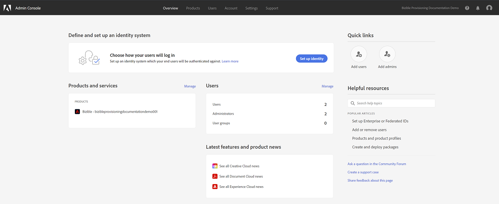

# Adobe Admin Console Setup {#adobe-admin-console-setup}

Det första steget till att använda [!DNL Marketo Measure] är att skapa och logga in på din tilldelade Adobe Admin Console. Om du inte redan har fått e-postmeddelandet med inloggningsanvisningar kontaktar du [!DNL Marketo Measure] Kontorepresentant.

## Konfigurera din Adobe Admin Console- och identitetsleverantör {#set-up-your-adobe-admin-console-and-identity-provider}

Som produkt i Adobe Suite [!DNL Marketo Measure] utnyttjar alla funktioner i Adobe Admin Console för Identity Management. Fler resurser kan [hittades här](https://helpx.adobe.com/se/enterprise/using/admin-console.html).

Vi rekommenderar att du granskar alla tillgängliga resurser, bästa praxis och alternativ för [Identity Management](https://helpx.adobe.com/enterprise/using/set-up-identity.html).

Om du vill ha vägledning och se hur du konfigurerar Identity Management i Adobe Admin Console kan du kontakta [!DNL Marketo Measure] Kontorepresentant.

För att underlätta användarautentisering och -auktorisering med [!DNL Marketo Measure] -instanser krävs följande steg i Adobe Admin Console:

**Konfigurera [!DNL Marketo Measure] Produktkort**

När du öppnar Adobe Admin Console ser du [!DNL Marketo Measure] Produktinstans(er) finns i avsnittet Översikt.

Klicka på [!DNL Marketo Measure] Produktkortet visar alla dina [!DNL Marketo Measure] instans(er). Som standard är varje [!DNL Marketo Measure] Instansen har en egen profil som prefix med &#39;[!DNL Marketo Measure]&#39;. Alla administratörer och användare som har lagts till i den här eller andra profiler i den här instansen kan logga in på [!DNL Marketo Measure].

Ingen åtgärd krävs för att skapa en ny profil i [!DNL Marketo Measure] Produktinstans(er).

Börja lägga till användare som har åtkomst [!DNL Marketo Measure], se [Lägger till [!DNL Marketo Measure] Administratörer och [!DNL Marketo Measure] Användare](#adding-marketo-measure-admins-and-marketo-measure-users) nedan.

## Lägger till [!DNL Marketo Measure] Administratörer och [!DNL Marketo Measure] Användare {#adding-marketo-measure-admins-and-marketo-measure-users}

Nästa steg är att ge åtkomst till [!DNL Marketo Measure] genom att lägga till användare. Detta kan göras i katalogen admins och users i [!DNL Marketo Measure] produktkort.

| Användartyp | Beskrivning |
|---|---|
| Administratörer | är administratörer och avancerade användare av [!DNL Marketo Measure] Program med fullständig möjlighet att uppdatera och hantera [!DNL Marketo Measure]-specifika konfigurationsalternativ |
| Användare | dessa är standardanvändare av [!DNL Marketo Measure] Program med skrivskyddad behörighet i [!DNL Marketo Measure] program |

När du lägger till en användare i deras respektive grupp ser du deras [Identitetstyp listad](https://helpx.adobe.com/enterprise/admin-guide.html/enterprise/using/set-up-identity.ug.html).

>[!NOTE]
>
>För att vara [!DNL Marketo Measure] administratör (in [experience.adobe.com/marketo-measure](https://experience.adobe.com/marketo-measure){target="_blank"}) måste en användare läggas till som användare _och_ en administratör till någon [!DNL Marketo Measure] produktprofil i [!DNL Marketo Measure] produktkort.

**Logga in på[!DNL Marketo Measure]**

När en användare har lagts till i en produktprofil kan han/hon komma åt sin [!DNL Marketo Measure] genom att välja **Logga in med Adobe ID** option at [experience.adobe.com/marketo-measure](https://experience.adobe.com/marketo-measure){target="_blank"}.

