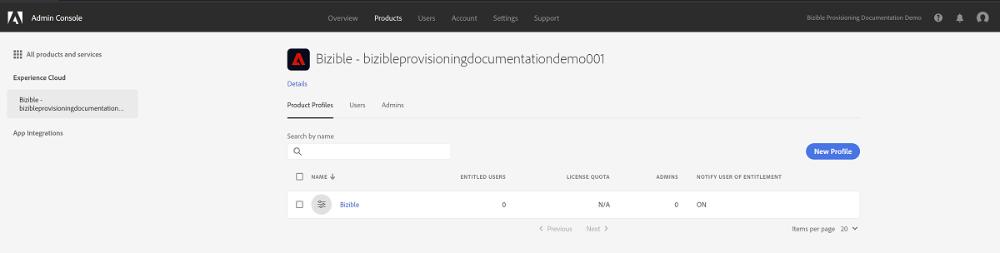

# Adobe Admin Console Setup {#adobe-admin-console-setup}

Det första steget för att använda [!DNL Marketo Measure] är att skapa och logga in på din tilldelade Adobe Admin Console. Om du inte har fått e-postmeddelandet med inloggningsanvisningar kontaktar du din [!DNL Marketo Measure]-kontorepresentant.

## Konfigurera din Adobe Admin Console- och identitetsleverantör {#set-up-your-adobe-admin-console-and-identity-provider}

Som produkt i Adobe Suite använder [!DNL Marketo Measure] alla funktioner i Adobe Admin Console för Identity Management. Fler resurser [finns här](https://helpx.adobe.com/se/enterprise/using/admin-console.html).

Vi rekommenderar att du granskar de resurser, bästa praxis och alternativ som är tillgängliga för dig för [Identity Management](https://helpx.adobe.com/enterprise/using/set-up-identity.html).

Kontakta din [!DNL Marketo Measure]-kontorepresentant om du vill ha hjälp med och granska hur du konfigurerar din Identity Management inom Adobe Admin Console.

För att underlätta användarautentisering och -auktorisering med dina [!DNL Marketo Measure]-instanser krävs följande steg i Adobe Admin Console:

**Konfigurera [!DNL Marketo Measure]-produktkortet**

När du använder Adobe Admin Console visas dina [!DNL Marketo Measure]-produktinstanser i avsnittet Översikt.

Om du klickar på produktkortet [!DNL Marketo Measure] visas alla dina [!DNL Marketo Measure]-instanser. Som standard har varje [!DNL Marketo Measure]-instans en egen profil som prefix med [!DNL Marketo Measure]. Alla administratörer och användare som har lagts till i den här eller andra profiler i den här instansen kan logga in på [!DNL Marketo Measure].

Ingen åtgärd krävs för att skapa en profil i [!DNL Marketo Measure] produktinstans(er).

Om du vill lägga till användare som har åtkomst till [!DNL Marketo Measure] går du till avsnittet [Lägga till [!DNL Marketo Measure] administratörer och [!DNL Marketo Measure] Användare](#adding-marketo-measure-admins-and-marketo-measure-users) nedan.

## Lägger till [!DNL Marketo Measure] administratörer och [!DNL Marketo Measure] användare {#adding-marketo-measure-admins-and-marketo-measure-users}

Nästa steg är att bevilja åtkomst till programmet [!DNL Marketo Measure] genom att lägga till användare. Detta kan göras i katalogen admins och users för produktkortet [!DNL Marketo Measure].

| Användartyp | Beskrivning |
|---|---|
| Administratörer | det här är administratörer och avancerade användare av programmet [!DNL Marketo Measure] med fullständig möjlighet att uppdatera och hantera [!DNL Marketo Measure]-specifika konfigurationsalternativ |
| Användare | dessa är standardanvändare av programmet [!DNL Marketo Measure] med skrivskyddad behörighet i programmet [!DNL Marketo Measure] |

När du lägger till en användare i deras respektive grupp visas deras [identitetstyp &#x200B;](https://helpx.adobe.com/enterprise/using/set-up-identity.html).

>[!NOTE]
>
>För att bli [!DNL Marketo Measure]-administratör (i [experience.adobe.com/marketo-measure](https://experience.adobe.com/marketo-measure){target="_blank"}) måste en användare läggas till som användare _och_ som administratör för alla [!DNL Marketo Measure]-produktprofiler på [!DNL Marketo Measure]-produktkortet.

**Loggar in på[!DNL Marketo Measure]**

När en användare har lagts till i en produktprofil kan de komma åt sina [!DNL Marketo Measure]-instanser genom att välja alternativet **Logga in med Adobe ID** på [experience.adobe.com/marketo-measure](https://experience.adobe.com/marketo-measure){target="_blank"}.

