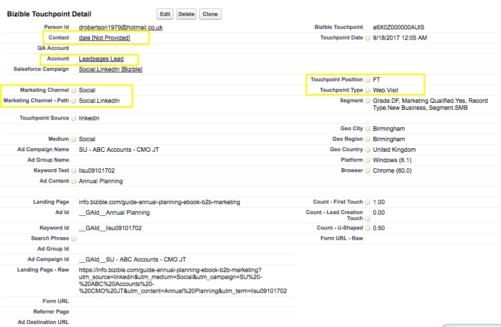

# Skillnad mellan Buyer Touchpoints och Buyer Attribution Touchpoints {#difference-between-buyer-touchpoints-and-buyer-attribution-touchpoints}

Läs vad som definierar en Buyer Touchpoint (BT) och Buyer Attribution Touchpoint (BAT), skillnaderna mellan de båda och svara på vanliga frågor.

Den viktigaste skillnaden mellan Buyer Touchpoints och Buyer Attribution Touchpoints är deras relation till [!DNL Salesforce]-objekt. BT relaterar till lead-, kontakt- och case-objekten, men inte till säljprojektsobjektet. Betyder att det aldrig finns några intäkter kopplade till Buyer Touchpoints.

Buyer Attribution Touchpoint-objektet är relaterat till kontaktobjektet, kontot och säljprojektsobjektet, men inte till lead-objektet. Kontaktpunkterna för köparattribuering är inte kopplade till leads. I BAT Object ser du de intäkter som är kopplade till specifika marknadsföringsinteraktioner.

Skillnad mellan BT och BAT:

<table> 
 <colgroup> 
  <col> 
  <col> 
 </colgroup> 
 <tbody> 
  <tr> 
   <td>Buyer Touchpoint (BT)</td> 
   <td>Buyer Attribution Touchpoint (BAT)</td> 
  </tr> 
  <tr> 
   <td> 
    <ul> 
     <li>Relaterar till lead-, kontakt- och case-objekt</li> 
     <li>Relaterar inte objektet säljprojekt</li> 
     <li>Intäkter är inte kopplade till en Buyer Touchpoint</li> 
    </ul></td> 
   <td> 
    <ul> 
     <li>Relaterar till kontakt-, konto- och säljprojektsobjekt</li> 
     <li>Relaterar inte lead-objektet</li> 
     <li>Eftersom en Buyer Attribution Touchpoint är kopplad till ett säljprojekt har alla BAT intäkter kopplade till sig</li> 
    </ul></td> 
  </tr> 
 </tbody> 
</table>

## Vanliga frågor och svar {#faq}

**När blir en Buyer Touchpoint Buyer Attribution Touchpoint?**

En BT blir en BAT när den här BT är kopplad till en kontakt som har en associerad möjlighet. En viktig sak att förstå är att en specifik marknadsföringsinteraktion kan vara en BT och en BAT.

**Kan en Buyer Touchpoint ha en kontaktpunktsposition för skapande av säljprojekt?**

En Buyer Touchpoint har bara en kontaktpunktsposition som är antingen First Touch (FT), Lead Creation (LC) eller Form Submit (mellanliggande kontaktytor). Eftersom BT inte är relaterade till säljprojekt är det inte möjligt för en BT att ha en kontaktpunktsposition för skapande av säljprojekt eller stängd.

**Hur används Buyer Touchpoint-data?**

Vanligtvis använder man Buyer Touchpoint-data för att förstå Top of the Trnel &amp; Middle of the Tratt Engagement. Det innebär att [!DNL Marketo Measure] användare vet vem som skickar formulär, vem som visar sin webbplats, vilket blogginlägg som fungerar bra, vad AdWords och som driver dem leder till konverteringar och så vidare. Buyer Touchpoint data är bra för att förstå hur era leads och kontakter är engagerade.

**Hur ser en Buyer Touchpoint ut i Salesforce?**

Här är en skärmbild av en BT i [!DNL Salesforce]:

{width="600" zoomable="yes"}

**Hur ser en Buyer Attribution Touchpoint ut i Salesforce?**

Här är en skärmbild av en BAT i [!DNL Salesforce]:

{width="600" zoomable="yes"}
