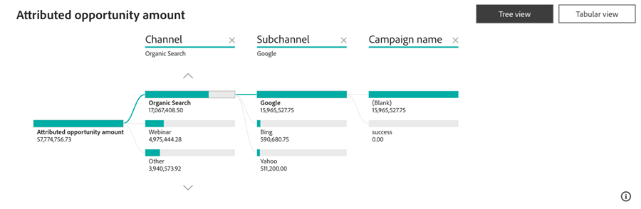

# Kontrollpanel för attributerade affärsmöjligheter {#attributed-opportunity-dashboard}

Kontrollpanelen för attributerade säljprojekt ger en heltäckande bild av hur marknadsföringssatsningarna bidrar till både nya och mogna försäljningsmöjligheter. Utnyttja detaljerna i alla öppna och stängda möjligheter som kan tillskrivas era strategier, med flexibiliteten att filtrera efter affärsfas, vilket understryker marknadsföringens fulla påverkan utöver slutna avtal.

**Frågor om kontrollpanelens svar**:

* Vilka kanaler, underkanaler eller kampanjer rangordnas högst när det gäller tilldelat affärsmöjlighetsbelopp?
* Hur stor är den totala fördelade affärsmöjligheten och antalet tilldelade öppna och stängda affärsmöjligheter?

## Kontrollpanelskomponenter {#dashboard-components}

### KPI-paneler {#kpi-tiles}

* **Attributerat affärsmöjlighetsbelopp**: Det totala intäktsbidraget, baserat på den valda attribueringsmodellen, från stängda och öppna affärsmöjligheter med kontaktytor som skapades inom den filtrerade datumperioden.
* **Attributerade affärsmöjligheter**: Antalet stängda och öppna affärsmöjligheter som har kontaktytor.

### Diagram över tilldelat affärsmöjlighetsbelopp per kanal över tid {#attributed-opportunity-amount-by-channel-over-time-chart}

Staplat stapeldiagram med totalt attributerat säljprojektsbelopp, segmenterat efter kanal, för varje månad/kvartal/år.

* Utnyttja detaljfunktionerna för att kategorisera data per månad, kvartal eller år.
* Håll pekaren över ett stolpsegment eller mellanrummet mellan stolparna för att visa detaljerad information.

**Frågar diagramsvaren**:

* Vilka kanaler genererade det mest tilldelade affärsmöjlighetsbeloppet varje kvartal?
* Hur fördelades tilldelat affärsmöjlighetsbelopp per kanal förra månaden?

### Attribuerad beloppstabell för affärsmöjlighet {#attributed-opportunity-amount-table}

Totalt tilldelat affärsmöjlighetsbelopp segmenterat efter kanal, delkanal och kampanj, presenteras i både tabell- och trädformat. Klicka på knappen i det övre högra hörnet för att växla mellan vyer.

**Frågor till styrelsen**:

* Hur varierar den tilldelade fördelningen av affärsmöjlighetens belopp mellan olika underkanaler i en kanal?
* Vilka kampanjer under en viss underkanal genererar det mest tilldelade antalet affärsmöjligheter?

#### Tabellvy {#tabular-view}

Tabellvyn ger tydliga och välorganiserade insikter i fördelningen av tilldelat affärsmöjlighetsbelopp. Användarna kan snabbt identifiera resultatmönster och identifiera slagkraftiga marknadsföringsstrategier genom att kategorisera data i kanaler, delkanaler och kampanjer.

Klicka på ikonen **+** bredvid varje kanal om du vill visa uppdelningen efter subkanal och kampanj.

#### Trädvy {#tree-view}

Trädvyn möjliggör en mer interaktiv och detaljerad datautforskning, vilket gör det möjligt för marknadsförare att identifiera trender, avvikelser eller utomordentliga resultat i sina marknadsföringssatsningar.

Klicka på en gren för att gå djupare in i det efterföljande hierarkilagret.

### Filterruta

Kontrollpanelen är utrustad med följande inställningar och filter:

* Datum (baserat på datum då affärsmöjligheten skapades)
* Attributionsmodell
   * För öppna möjligheter erbjuder attribueringsmodellerna &#39;fullständig sökväg&#39; och &#39;anpassad&#39; punktvisa vyer och representerar inte slutliga attribueringsresultat.
* Fas i affärsmöjlighet (baserat på aktuell fas)
* Kanal, delkanal
* Campaign
* Segment
