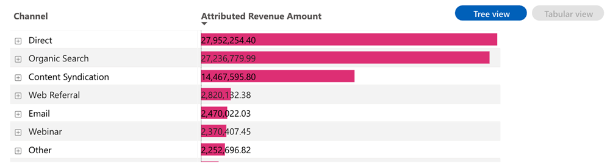

# Kontrollpanel för attributerade intäkter {#attributed-revenue-dashboard}

Kontrollpanelen för attributerade intäkter ger ett fokuserat perspektiv på de intäkter som är direkt kopplade till era marknadsföringssatsningar. Utforska ingående hur era marknadsföringsstrategier har varit avgörande för att försegla avtal.

Frågor till styrelsen:

Vilka kanaler, underkanaler eller kampanjer rangordnas högst när det gäller de tilldelade intäkterna?
Hur stor är den totala intäkten och antalet avsatta slutna avtal?

<table style="table-layout:auto"> 
<tbody>
  <tr> 
   <th>Komponent</th> 
   <th>Beskrivning</th>
   <th>Granska fält</th>
   <th>Datumtyp</th>
   <th>Filter</th>
  </tr>
  <tr>
    <td>Attribuerad intäktsruta</td>
    <td>Totala intäkter från"Closed Won"-möjligheter med registrerade kontaktytor.</td>
    <td rowspan="6"><li>ID för affärsmöjlighet</li>
<li>Affärsmöjlighetens namn</li>
<li>Skapad affärsmöjlighet</li>
<li>Stängningsdatum för affärsmöjlighet</li>
<li>Är stängd (J/N)</li>
<li>Är vunnen (J/N)</li>
<li>Aktuell fas</li>
<li>Attributionsmodell</li>
<li>Attribuerad intäkt</li>
<li>Realiserad intäkt</li></td>
    <td rowspan="6">Stängt den</td>
    <td rowspan="6"><li>Datum</li>
<li>Attributionsmodell</li>
<li>Kanal</li>
<li>Delkanal</li>
<li>Campaign</li>
<li>Segment</li></td>
  </tr>
  <tr>
    <td>Attribut för avtalsruta</td>
    <td>Totalt antal"Closed Won"-erbjudanden från hänförliga möjligheter.</td>
  </tr>
  <tr>
    <td>Attribuerad intäkt per kanal över tid</td>
    <td>Staplat stapeldiagram med totala attributerade intäkter, segmenterade efter associerad kanal, för varje kvartal/månad.
     </td>
  </tr>
  <tr>
    <td>Attribuerad intäktstabell</td>
    <td>Totala tillskrivna intäkter segmenterade efter kanal, delkanal och kampanj, presenteras i både tabell- och trädformat.
     
     </td>
  </tr>
  </tr>
</tbody>
</table>

>[!MORELIKETHIS]
>
>[Grunderna i kontrollpanelen](/help/marketo-measure-discover-ui/dashboards/discover-dashboard-basics.md){target="_blank"}
