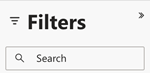

# Grunderna i kontrollpanelen {#discover-dashboard-basics}

I den här artikeln får du hjälp med grundläggande funktioner i det nya gränssnittet, så att du enkelt kan komma åt och tolka dina data. Ta dig in i filterpanelens dynamik och upptäck hur invecklade våra förbättrade rapporteringsfunktioner är, till exempel detaljfunktioner, korsfiltrering och verktygstips.

>[!NOTE]
>
>Den här instrumentpanelen finns för närvarande i Beta. Under denna övergångsfas kommer både den nuvarande och den nya kontrollpanelen att vara tillgänglig. Den aktuella instrumentpanelen kommer att bli inaktuell när vi har övergått fullständigt och säkerställt optimal funktionalitet.

## Filterruta {#filter-pane}

På varje kontrollpanel finns ett antal filter som följs av följande kontroller för smidig navigering och anpassning.

<table style="table-layout:auto"> 
 <tbody> 
  <tr> 
   <th>Namn</th> 
   <th>Beskrivning</th>
  </tr> 
  <tr> 
   <td>Växla filter</td>
   <td>Växla filterrutan öppen eller stängd.
   
</td>
  </tr>
  <tr> 
   <td>Återställ knapp</td>
   <td>Återställa filter till standardinställningarna.
   
</td>
  </tr>
   <tr> 
   <td>Knappen Använd</td>
   <td>Klicka för att bekräfta och implementera dina filterändringar på kontrollpanelen.
   
</td>
  </tr>
  <tr> 
   <td>Segmentknapp</td>
   <td>På kontrollpaneler med segmentfilter klickar du på knappen Segment längst ned i filterrutan för att gå över till Segment.
   
</td>
  </tr>
 </tbody> 
</table>

## Filter på visuell {#filters-on-visual}

Hovra över det övre högra hörnet av en visuell bild för att se en skrivskyddad lista över använda filter.

## Rapportfunktioner {#report-capabilities}

### Öka och minska detaljnivån {#drill-down-and-up}

* Hovra över en visuell vy för att identifiera om den har en hierarki. Om det finns detaljkontrollalternativ i åtgärdsfältet visas detta.

* Aktivera detaljfunktionen genom att klicka på den nedåtriktade pilen som är markerad med en grå bakgrund. Om du vill återgå använder du ikonen för detaljgranskning.

Om du vill gå ned ett fält i taget aktiverar du detaljnivåikonen och väljer ett visuellt element, t.ex. ett fält.

Använd dubbelpilens detaljikon för att gå till nästa hierarkinivå.

Använd den gaffelliknande ikonen om du vill lägga till ytterligare en hierarkinivå i den aktuella vyn.

### Detaljgranska {#drill-through}

Om du vill utforska de data som ligger bakom det visuella objektet högerklickar du på det visuella elementet och väljer alternativet Detaljerad.

### Exportera data {#export-data}

Om du vill exportera underliggande data från en visuell bild håller du pekaren över det övre högra hörnet. Klicka på knappen &quot;Fler alternativ&quot;, välj &quot;Exportera data&quot;, välj det format du vill använda och klicka sedan på &quot;Exportera&quot;.

### Fokuseringsläge {#focus-mode}

Om du vill zooma in på en viss visuell sida eller ruta håller du pekaren över det övre högra hörnet och väljer knappen &quot;Fokus&quot;.

### Korsfiltrering {#cross-filtering}

Om du väljer ett värde eller en axeletikett i en visualisering filtreras andra bilder på rapportsidan så att endast relevanta, filtrerade data visas.

### Verktygstips {#tooltips}

Verktygstips innehåller extra information om de data som visas. Håll muspekaren över ett visuellt element så visas ett sammanhangsberoende verktygstips med information om den specifika datapunkten.

