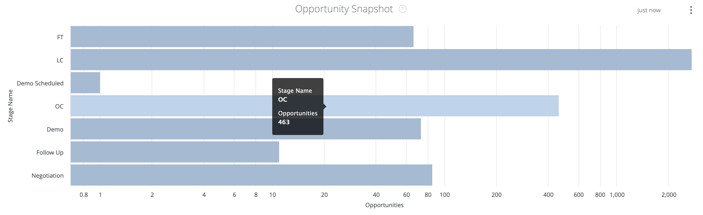

# Dokumentation för instrumentpanel för ögonblicksbild {#snapshot-dashboard-documentation}

Med kontrollpanelen för ögonblicksbilder kan du visa CRM-status vid en given tidpunkt, med distribution av poster mellan lead-/kontakt- och säljprojektsfaserna.

Den här instrumentpanelen har två paneler:

* **Ögonblicksbild av lead/kontakt:** Antalet lead- eller kontaktposter i varje fas på det valda datumet.

>[!NOTE]
>
>På alla Discover-paneler kan bara ett personobjekt, antingen lead eller kontakt, rapporteras. Detta anges i [!UICONTROL Settings] > [!UICONTROL Reporting] > [!UICONTROL Attribution Settings] > [!UICONTROL Default Dashboard Object].

* **Snapshot:** Antalet säljprojektsposter i varje fas på det valda datumet.

Den här instrumentpanelen har stöd för följande filter (alla filter gäller båda plattorna):

* Datum för ögonblicksbild: välj datum för ögonblicksbilden.
* ID/namn för CRM-konto: filtrera posterna efter ID eller namn för CRM-konto.

>[!NOTE]
>
>Förslag visas endast med namn.

* Kanal: filtrera posterna efter kanaler. En post kopplas till en kanal om någon av dess kontaktytor är kopplad till kanalen.
* Delkanal: filtrera posterna efter delkanaler. En post kopplas till en underkanal om någon av dess kontaktytor är kopplad till underkanalen.
* Campaign: filtrera posterna efter kampanjer. En post associeras med en kampanj om någon av dess kontaktytor är associerad med kampanjen.
* Kampanjkälla: filtrera posterna efter kampanjkällor. Exempel på kampanjkällor är [!DNL Adwords], [!DNL BingAds], [!DNL Facebook], [!DNL LinkedIn], osv. En post kopplas till en kampanjkälla om någon av dess kontaktytor är kopplad till kampanjkällan.
* ID/namn för annonskonto: filtrera posterna efter ID eller namn för annonskonto. En post kopplas till ett annonskonto om någon av dess kontaktytor är kopplad till en kampanj från de valda annonskontona.

>[!NOTE]
>
>Förslag visas endast med namn.

* Segmentfilter: filtrera posterna efter anpassade segment. En post kopplas till ett segment om någon av dess kontaktytor är kopplad till segmentet.

För alla filter används&quot;AND&quot;-logik.

>[!NOTE]
>
>Om en post ändrar fas på det valda datumet räknas posten för från- och till-stadierna och alla genomströmningsfaser.

## Ögonblicksbild av lead/kontakt {#lead-contact-snapshot}

Stegen omfattar FT, LC och valda trattfaser i öppna lead-/kontaktstadier ([!UICONTROL Settings] > [!UICONTROL CRM] > [!UICONTROL Stage Mapping]).

Du kan gå ned i varje fält för att visa lead-/kontaktposterna för varje fas.

## Ögonblicksbild av affärsmöjlighet {#opportunity-snapshot}

Stegen omfattar FT, LC, valda trattfaser i öppna lead-/kontaktstadier ([!UICONTROL Settings] > [!UICONTROL CRM] > [!UICONTROL Stage Mapping]). Och OC och valda trattfaser i öppna säljprojektsfaser ([!UICONTROL Settings] > [!UICONTROL CRM] > [!UICONTROL Stage Mapping]).

Du kan gå ned på detaljnivå från varje fält för att visa säljprojektsposterna för varje fas.
