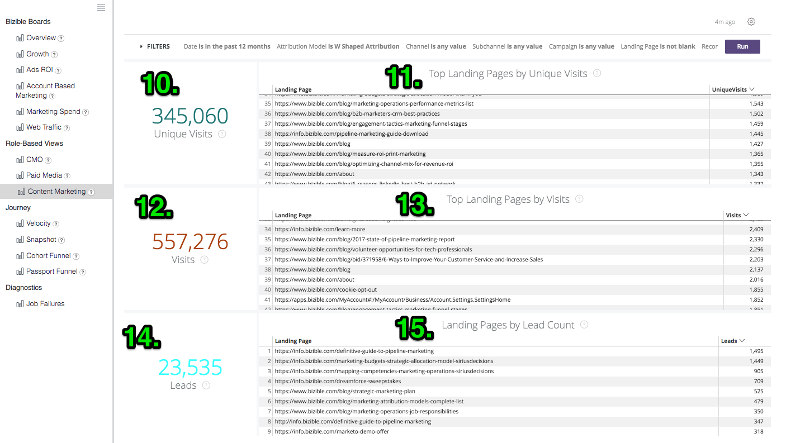
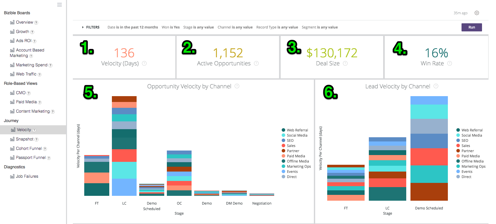

# Definitioner och uppslagsverk {#definitions-and-encyclopedia}

Här följer en översikt över de olika panelerna och plattformarna som finns på Discover-plattformen samt de filter som finns på dessa. På skärmbilden av varje styrelse finns ett antal paneler, vars definitioner återfinns i styrelsens avsnitt nedan.

**[!DNL Marketo Measure]Varumärkena**

Översikt

Tillväxt

annonsavkastning

Kontobaserad marknadsföring

Marknadsföringsutgifter

Webbtrafik

**Rollbaserade vyer**

CMO

Betalda media

Innehållsmarknadsföring

Marknadsföringsobjekt

**Resa**

Hastighet

Ögonblicksbild

Passport-tratt

Åtagandesökväg

## [!DNL Marketo Measure] Varumärkena {#marketo-measure-boards}

### Översikt {#overview}

Översikt ger användaren en högnivåbild av hur marknadsföringsteamet presterar när det gäller deras inverkan på intäkter, utgifter och avkastning.

**Filter**

Datumtyp stängningsdatum

Datum för de senaste 12 fullständiga månaderna

Attributmodellen är W-Shaped

Mått är intäkt

Dimensionen är kanal

Kanalen är lika med __

Delkanalen är lika med __

Kampanjen är lika med __

Kategorier

**Intäkter**

`1.` Det totala intäktsbeloppet från Closed Won-möjligheter, baserat på attribueringsmodellen.

Klicka för att visa detaljer och fördjupa dig i data genom att visa dem som en visualisering och tabell.

**Ökning**

`2.` I listrutan Metrisk på menyn Filter visar det här diagrammet intäkter/pipelineintäkter/utgifter/erbjudanden/möjligheter/leads/kontakter som tilldelats varje kanal, som visas över tid.

**Utgift**

`3.` Det totala beloppet för inspelade utgifter från både API-kostnader och självrapporterade kostnader som sammanställts på den högsta kanalnivån.

Klicka för att visa detaljer och fördjupa dig i data genom att visa dem som en visualisering och tabell.

**avkastning**

`4.` I listrutan Dimensioner på filtermenyn visas hur mycket avkastning som tilldelats varje kanal/underkanal/kampanj/konto/adGrupp/annons/annons/kreativt/nyckelord/placering/plats baserat på attribueringsmodellen under hela det markerade datumintervallet.

**ROI - sammanfattning**

Med listrutan Dimensioner på filtermenyn visar detta hur mycket intäkter, utgifter och avkastning som tillskrivits varje kanal/underkanal/kampanj/konto/annonsgrupp/annons/annonsör/kreativt/nyckelord/placering/plats baserat på attribueringsmodellen under hela det markerade datumintervallet.

**Erbjudanden**

`5.` Det totala antalet stängda Won-möjligheter, baserat på antalet attribueringsmodeller. Om datumtypen &quot;Slutpunktsdatum&quot; är markerad går det att göra partiella inventeringar eftersom det går att utesluta vissa kontaktytor inom en affärsmöjlighet med den här datumtypen.

Klicka för att visa detaljer och fördjupa dig i data genom att visa dem som en visualisering och tabell.

**Kostnad per avtal**

`6.` Den totala utgiften dividerat med det totala antalet avtal, vilket ger en genomsnittlig kostnad som krävs för att förvärva en stängd vinstmöjlighet.

**Försäljningsförlopp**

`7.` Den totala potentiella intäkten från alla öppna affärsmöjligheter, vilket innebär att den inte är stängd, förlorad eller avbruten. Intäkterna baseras på den valda attribueringsmodellen.

Klicka för att visa detaljer och fördjupa dig i data genom att visa dem som en visualisering och tabell.

**Avtalsstorlek**

`8.` Genomsnittligt belopp för en stängd Won-affärsmöjlighet.

**Kanalsammanfattning**

`9`. Med listrutan Metrisk på menyn Filter är det här en lista med kanaler som baseras på hur mycket intäkter/försäljningsintäkter/försäljningsintäkter/utgifter/affärsmöjligheter/leads/kontakter som tilldelats varje kanal, sorterat efter den högsta baserat på den valda attribueringsmodellen.

**Sammanfattning av delkanal**

`10.` Med listrutan Metrisk på menyn Filter är det här en lista med delkanaler som baseras på hur mycket intäkter/försäljningsintäkter/försäljningsintäkter/utgifter/erbjudanden/leads/kontakter som tilldelats varje underkanal, sorterat efter den högsta baserat på den valda attribueringsmodellen.

**Kampanjsammanfattning**

`11.` Med hjälp av listrutan Metrisk på menyn Filter är det här en lista över kampanjer som baseras på hur mycket intäkter/försäljningsintäkter/försäljningsintäkter/-utgifter/-erbjudanden/säljtillfällen/leads/kontakter som tillskrevs varje kampanj, sorterat efter den högsta baserat på den valda attribueringsmodellen.

### Tillväxt {#growth}

Med tillväxt kan marknadsföraren se vad de har genererat över hela linjen, från leads till kontakter till möjligheter till intäkter. Det är en snabb överblick över alla rörliga bilder och hur de har gått över tiden.

**Filter**

Datumtypen är Touchpoint-datum

Datum för de senaste 12 fullständiga månaderna

Attributmodellen är W-Shaped

Gruppera efter ingen

Kanalen är lika med __

Delkanalen är lika med __

Kampanjen är lika med __

Kategorier

**Intäkter**

`1.` Det totala intäktsbeloppet från Closed Won-möjligheter, baserat på attribueringsmodellen.

Klicka för att visa detaljer och fördjupa dig i data genom att visa dem som en visualisering och tabell.

**Intäkter över tid**

`2.` Det totala intäktsbeloppet från stängda vinstmöjligheter, baserat på attribueringsmodellen som visar trenden under en viss tidsram. Använd filtret Gruppera efter för att ändra stapeln efter kanal, delkanal, kampanj, konto, annonsgrupp, annons, annonsör, kreativt, nyckelord, placering, webbplats.

Granska in för att visa data från en mindre datumdimension.

**Erbjudanden**

`3.` Det totala antalet stängda Won-möjligheter, baserat på antalet attribueringsmodeller.

Klicka för att visa detaljer och fördjupa dig i data genom att visa dem som en visualisering och tabell.

**Erbjudanden över tid**

`4.` Det totala antalet stängda Won-möjligheter, baserat på attribueringsmodellen som visar trenden under en viss tidsram. Använd filtret Gruppera efter för att ändra stapeln efter kanal, delkanal, kampanj, konto, annonsgrupp, annons, annonsör, kreativt, nyckelord, placering, webbplats.

Granska in för att visa data från en mindre datumdimension.

**Försäljningsförlopp**

`5.` Den totala potentiella intäkten från alla öppna affärsmöjligheter, vilket innebär att den inte är stängd, förlorad eller avbruten. Intäkterna baseras på den valda attribueringsmodellen.

Klicka för att visa detaljer och fördjupa dig i data genom att visa dem som en visualisering och tabell.

**Pipeline-intäkter över tid**

`6.` De totala potentiella intäkterna från alla öppna affärsmöjligheter, baserat på attribueringsmodellen som visar trenden under en viss tidsram. Använd filtret Gruppera efter för att ändra stapeln efter kanal, delkanal, kampanj, konto, annonsgrupp, annons, annonsör, kreativt, nyckelord, placering, webbplats.

Granska in för att visa data från en mindre datumdimension.

**Leads**

`7.` Det totala antalet leads, baserat på attribueringsmodellen. Om datumtypen &quot;Slutpunktsdatum&quot; är markerad går det att göra partiella inventeringar eftersom det går att utesluta vissa kontaktytor i en Lead-post med den här datumtypen. Om en attribueringsmodell som ligger utanför U-Shaped används U-Shaped-värdet för W-Shaped, W-Shaped och Custom Model.

Klicka för att visa detaljer och fördjupa dig i data genom att visa dem som en visualisering och tabell.

**Leads över tid**

`8.` Det totala antalet leads, baserat på attribueringsmodellen som visar trenden under en viss tidsperiod. Använd filtret Gruppera efter för att ändra stapeln efter kanal, delkanal, kampanj, konto, annonsgrupp, annons, annonsör, kreativt, nyckelord, placering, webbplats.

Granska in för att visa data från en mindre datumdimension.

**Kontakter**

`9.` Det totala antalet kontakter, baserat på attribueringsmodellen. Om datumtypen &quot;Kontaktpunktsdatum&quot; är markerad går det att göra partiella räkningar eftersom det går att utesluta vissa kontaktytor i en kontaktpost med den här datumtypen. Om en attribueringsmodell som ligger utanför U-Shaped används U-Shaped-värdet för W-Shaped, W-Shaped och Custom Model.

Klicka för att visa detaljer och fördjupa dig i data genom att visa dem som en visualisering och tabell.

**Kontakter över tid**

`10.` Det totala antalet kontakter, baserat på attribueringsmodellen som visar trenden under en viss tidsperiod. Använd filtret Gruppera efter för att ändra stapeln efter kanal, delkanal, kampanj, konto, annonsgrupp, annons, annonsör, kreativt, nyckelord, placering, webbplats.

Granska in för att visa data från en mindre datumdimension.

**Möjligheter**

`11.` Det totala antalet affärsmöjligheter, baserat på attribueringsmodellen. Om datumtypen &quot;Slutpunktsdatum&quot; är markerad går det att göra partiella inventeringar eftersom det går att utesluta vissa kontaktytor i en säljprojektspost med den här datumtypen.

Klicka för att visa detaljer och fördjupa dig i data genom att visa dem som en visualisering och tabell.

**Möjligheter över tid**

`12.` Det totala antalet affärsmöjligheter, baserat på attribueringsmodellen som visar trenden under en viss tidsperiod. Använd filtret Gruppera efter för att ändra stapeln efter kanal, delkanal, kampanj, konto, annonsgrupp, annons, annonsör, kreativt, nyckelord, placering, webbplats.

Granska in för att visa data från en mindre datumdimension.

**Besök**

`13.` Det totala antalet webbplatsbesök som spåras för alla kända och anonyma besökare.

Klicka för att visa detaljer och fördjupa dig i data genom att visa dem som en visualisering och tabell.

(Detta visas som 0 om den här funktionen är inaktiverad.)

**Besök över tid**

`14.` Det totala antalet besök på plats som spårats visar trenden under en viss tidsperiod. Använd filtret Gruppera efter för att ändra stapeln efter kanal, delkanal, kampanj, konto, annonsgrupp, annons, annonsör, kreativt, nyckelord, placering, webbplats.

Granska in för att visa data från en mindre datumdimension.

(Detta visas tomt om den här funktionen är inaktiverad.)

**Unika besök**

`15.` Det totala antalet unika webbplatsbesök som spåras för alla kända och anonyma besökare.

Klicka för att visa detaljer och fördjupa dig i data genom att visa dem som en visualisering och tabell.

(Detta visas som 0 om den här funktionen är inaktiverad.)

**Unika besök över tid**

`16.` Det totala antalet unika besök på plats som spårats visar trenden under en viss tidsperiod. Använd filtret Gruppera efter för att ändra stapeln efter kanal, delkanal, kampanj, konto, annonsgrupp, annons, annonsör, kreativt, nyckelord, placering, webbplats.

Granska in för att visa data från en mindre datumdimension.

(Detta visas tomt om den här funktionen är inaktiverad.)

**Forms**

`17.` Det totala antalet formulär som skickats in för alla kända och anonyma besökare.

Klicka för att visa detaljer och fördjupa dig i data genom att visa dem som en visualisering och tabell.

(Detta visas som 0 om den här funktionen är inaktiverad.)

**Forms över tid**

`18.` Det totala antalet inlämnade formulär som visar utvecklingen under en viss tidsperiod. Använd filtret Gruppera efter för att ändra stapeln efter kanal, delkanal, kampanj, konto, annonsgrupp, annons, annonsör, kreativt, nyckelord, placering, webbplats.

Granska in för att visa data från en mindre datumdimension.

(Detta visas tomt om den här funktionen är inaktiverad.)

### annonsavkastning {#ads-roi}

Med avkastningen på annonser får betalmedieansvariga en inblick i sina marknadsföringssatsningar så att de får insikt i hur deras kampanjer fungerar när det gäller nyckelordsprestanda.

**Filter**

Datumtyp stängningsdatum

Datum för de senaste 12 fullständiga månaderna

Attributmodellen är W-Shaped

Kanalen är lika med __

Delkanalen är lika med __

Kampanjen är lika med __

Kategorier

**Sammanfattning av kampanjavkastning**

`1.` En lista med kampanjer baserad på hur mycket intäkter, utgifter och avkastning som tillskrivs varje kampanj, sorterat efter de högsta intäkterna baserat på den valda attribueringsmodellen.

**Översikt över avkastning på investering**

`2.` En lista över kreatörer baserat på hur mycket intäkter, utgifter och avkastning som tillskrivs varje kreatör, sorterat efter de högsta intäkterna baserat på den valda attribueringsmodellen.

**Sammanfattning av nyckelordens ROI**

`3.` En lista med nyckelord baserad på hur mycket intäkter, utgifter och avkastning som tillskrivs varje nyckelord, sorterade efter den högsta intäkten baserat på den valda attribueringsmodellen.

### Kontobaserad marknadsföring {#account-based-marketing}

Kontobaserad marknadsföring ger företag som använder ABM möjlighet att följa upp sina satsningar på målkonton och hur mycket engagemang de har sett från sin marknadsföring.

**Filter**

Datumtypen är Touchpoint-datum

Datum för de senaste 12 fullständiga månaderna

Attributmodellen är W-Shaped Attribution

Gruppera efter är kanal

Konton är lika med __

**Intäkter**

Det totala intäktsbeloppet från Closed Won-möjligheter, baserat på attribueringsmodellen.

Klicka för att visa detaljer och fördjupa dig i data genom att visa dem som en visualisering och tabell.

**Försäljningsförlopp**

Den totala potentiella intäkten från alla öppna affärsmöjligheter, vilket innebär att den inte är stängd, förlorad eller avbruten. Intäkterna baseras på den valda attribueringsmodellen.

**Genomsnittligt antal beröringar per konto**

Genomsnittligt antal kontaktytor som genereras från varje CRM-konto, per konto-ID.

**Matchade leads**

Det totala antalet leads som matchades till ett konto med [!DNL Marketo Measure] Lead-till-konto-funktion, använda matchningsalgoritmer för webbplatser, företagsnamn och e-postdomäner.

**Angivna konton**

Det totala antalet konton som har tagit emot någon kontaktyta. Om en målkontolista används är detta deluppsättningen med konton från den målkontolistan.

**Engagerade affärsmöjligheter**

Det totala antalet möjligheter som har fått en kontaktyta. Om en målkontolista används är detta deluppsättningen av affärsmöjligheter från den målkontolistan.

**Engagerade enskilda**

Det totala antalet personer (leads och kontakter via e-postadresser) som tagit emot någon kontaktyta. Om en målkontolista används är det här delmängden av personer från den målkontolistan.

**Pekpunkter över tid**

Det totala antalet kontaktytor som registrerats under den angivna tidsperioden. Om en målkontolista används är detta deluppsättningen med konton från den målkontolistan.

**Konton som trycks över tid (diagram)**

Det totala antalet konton som har tagit emot en kontaktyta per månad under den angivna tidsperioden med möjlighet att gruppera resultaten efter kanal, underkanal, kampanj, konto, annonsgrupp, annonsgrupp, annonsör, kreativ, nyckelord, placering eller webbplats. Om en målkontolista används är detta deluppsättningen med konton från den målkontolistan.

**Konton efter antal kontaktpunkter**

Efter konto-ID och kontonamn, det totala antalet kontaktytor från varje konto.

**Antal kontaktpunkter**

Antalet kontaktytor som har tilldelats varje dimension, där dimensionen kan ändras av filtret Gruppera efter, t.ex.: Ingen / Kanal / Delkanal / Kampanj / Konto / Annonserare / Annonser / Kreativ / Annonsgrupp / Nyckelord / Placering / Webbplats.

### Marknadsföringsutgifter {#marketing-spend}

Marknadsföringsutgifter visar hur mycket marknadsförarna har spenderat under en tidsperiod så att de kan spåra utgifter per månad och kanal.

**Filter**

Datumtypen är Touchpoint-datum

Datum för de senaste 12 fullständiga månaderna

Attributionsmodell

Gruppera efter är lika med kanal

Kanalen är lika med __

Delkanalen är lika med __

Kampanjen är lika med __

**Intäkter**

Det totala intäktsbeloppet från Closed Won-möjligheter, baserat på attribueringsmodellen.

Klicka för att visa detaljer och fördjupa dig i data genom att visa dem som en visualisering och tabell.

**Utgift**

Det totala beloppet för inspelade utgifter från både API-kostnader och självrapporterade kostnader som sammanställts på den högsta kanalnivån.

Klicka för att visa detaljer och fördjupa dig i data genom att visa dem som en visualisering och tabell.

**avkastning**

Den beräknade avkastningen (avkastning på investering) från de totala intäkterna (från den valda attribueringsmodellen) och de totala utgifterna.

**Utgift (diagram)**

Det totala beloppet för bokförda utgifter som visar trenden under en viss tidsperiod. Använd filtret Gruppera efter för att ändra stapeln med Ingen, Kanal, Delkanal, Kampanj, Konto, Annonskoncern, Annonser, Kreativ, Nyckelord, Placering, Plats.

Eftersom Utgift inte registreras på alla nivåer är det möjligt att summorna inte är lika med varje gruppera efter-val. Summan av alla kampanjer kommer till exempel inte att vara lika med summan av alla delkanaler.

**Utgifter + avkastning**

Visar mängden marknadsföringsutgifter per månad tillsammans med avkastningen på investeringen på den högra y-axeln.

**Utgift per kanal**

En lista över kanaler baserat på hur mycket som rapporterades för varje kanal, sorterat efter de högsta utgifterna.

**Utgift per delkanal**

En lista med delkanaler baserat på hur mycket som rapporterades för varje delkanal, sorterat efter de högsta utgifterna.

**Utgifter per kampanj**

En lista med kampanjer baserat på hur mycket som rapporterades för varje kampanj, sorterat efter de högsta utgifterna. Kampanjerna består av en fullständig lista med kampanjer som innehåller utm_campaign-värden från sidvyer.

### Webbtrafik {#web-traffic}

Med webbtrafikvyn kan marknadsförarna spåra aktiviteter på sin webbplats och mäta trafik från både kända och anonyma besökare.

**Filter**

Datumtypen är Touchpoint-datum

Datum för de senaste 12 fullständiga månaderna

Attributmodellen är W-Shaped Attribution

URL är lika med __

Gruppera efter är ingen

Mått är besök

Kanalen är lika med __

Delkanalen är lika med __

Kampanjen är lika med __

**Unika besök**

Det totala antalet unika webbplatsbesök som spåras för alla kända och anonyma besökare.

Klicka för att visa detaljer och fördjupa dig i data genom att visa dem som en visualisering och tabell.

**Besök**

Det totala antalet webbplatsbesök som spåras för alla kända och anonyma besökare.

Klicka för att visa detaljer och fördjupa dig i data genom att visa dem som en visualisering och tabell.

**Kostnad per unikt besök**

Den totala kostnaden dividerad med det totala antalet unika besök, vilket ger kostnaden per unik besöksfrekvens.

**Kostnad per besök**

De totala utgifterna dividerat med det totala antalet besök, vilket ger kostnaden per besök.

**Intäkter per unikt besök**

Det beräknade genomsnittet av stängda intäkter per unikt besök på plats från kända och anonyma besökare.

**Intäkter per besök**

Det beräknade genomsnittet av stängda intäkter per besök på plats från kända och anonyma besökare.

**Sidvyer**

Det totala antalet sidvisningar som spåras för alla kända och anonyma besökare.

Klicka för att visa detaljer och fördjupa dig i data genom att visa dem som en visualisering och tabell.

**Forms**

Det totala antalet formulär som skickats in för alla kända och anonyma besökare.

Klicka för att visa detaljer och fördjupa dig i data genom att visa dem som en visualisering och tabell.

**Ökning**

I listrutan Metrisk på filtermenyn visar det här diagrammet intäkter/intäkter/kostnader/erbjudanden/möjligheter/leads/kontakter/klipp/besök/unika besök/sidvisningar/formulär som tilldelats varje dimension, som visas över tid. Dimensioner kan ändras från Ingen till Kanal/Underkanal/Kampanj/Konto/Advertiser/Annons/Creative/Annonsgrupp/Nyckelord/Placering/Plats.

**Översikt över webbtrafik**

På URL-adresser ser du hur många sidor, besök, besök och formulär som är betrodda för respektive sida.

**Sammanfattning av referenter**

Antalet sidbesök och unika besök som kommer från varje refererad URL.

**Unika besök efter källa**

Använd listrutan Gruppera efter på filtermenyn för att visa källan till de unika besökarna på platsen. Ändra gruppen till: kanal, delkanal, kampanj, konto, annonsgrupp, annonsgrupp, annonsör, kreativ, nyckelord, placering, webbplats.

**Besök efter källa**

Använd listrutan Gruppera efter på Filter-menyn för att visa källan för besökarna på platsen. Ändra gruppen till: kanal, delkanal, kampanj, konto, annonsgrupp, annonsgrupp, annonsör, kreativ, nyckelord, placering, webbplats.

**Leads efter landningssida**

En lista över landningssidor baserad på antalet leads som genererats från varje landningssida, sorterat efter det största antalet leads.

**Leads efter formulär-URL**

En lista över formulär-URL:er baserat på antalet leads som genererades från varje URL, sorterat efter det högsta antalet leads.

## Rollbaserade vyer {#role-based-views}

### CMO {#cmo}

CMO-vyerna ger marknadschefen en högnivåbild av hur marknadsföringsteamet presterar när det gäller deras inverkan på intäkter, utgifter och avkastning.

**Filter**

Datumtyp stängningsdatum

Datum för de senaste 12 fullständiga månaderna

Attributmodellen är W-Shaped

Kanalen är lika med __

Delkanalen är lika med __

Kampanjen är lika med __

Mått är intäkt

Kategorier

**Intäkter**

`1.` Det totala intäktsbeloppet från Closed Won-möjligheter, baserat på attribueringsmodellen.

Klicka för att visa detaljer och fördjupa dig i data genom att visa dem som en visualisering och tabell.

**Ökning**

`2.` I listrutan Metrisk på menyn Filter visar det här diagrammet intäkter/pipelineintäkter/utgifter/erbjudanden/möjligheter/leads/kontakter som tilldelats varje kanal, som visas över tid.

**Utgift**

`3.` Det totala beloppet för inspelade utgifter från både API-kostnader och självrapporterade kostnader som sammanställts på den högsta kanalnivån.

Klicka för att visa detaljer och fördjupa dig i data genom att visa dem som en visualisering och tabell.

**avkastning**

`4.` Den beräknade avkastningen (avkastning på investering) från de totala intäkterna (från den valda attribueringsmodellen) och de totala utgifterna.

**Erbjudanden**

`5.` Det totala antalet stängda Won-möjligheter, baserat på antalet attribueringsmodeller. Om datumtypen &quot;Slutpunktsdatum&quot; är markerad går det att göra partiella inventeringar eftersom det går att utesluta vissa kontaktytor inom en affärsmöjlighet med den här datumtypen.

Klicka för att visa detaljer och fördjupa dig i data genom att visa dem som en visualisering och tabell.

**Kostnad per avtal**

`6.` Den totala utgiften dividerat med det totala antalet avtal, vilket ger en genomsnittlig kostnad som krävs för att förvärva en stängd vinstmöjlighet.

**Försäljningsförlopp**

`7.` Den totala potentiella intäkten från alla öppna affärsmöjligheter, vilket innebär att den inte är stängd, förlorad eller avbruten. Intäkterna baseras på den valda attribueringsmodellen.

Klicka för att visa detaljer och fördjupa dig i data genom att visa dem som en visualisering och tabell.

**Avtalsstorlek**

`8.` Genomsnittligt belopp för en stängd Won-affärsmöjlighet.

**Kanalsammanfattning**

`9.` Med listrutan Metrisk på menyn Filter är det här en lista med kanaler som baseras på hur mycket intäkter/försäljningsintäkter/försäljningsintäkter/utgifter/affärsmöjligheter/leads/kontakter som tilldelats varje kanal, sorterat efter den högsta baserat på den valda attribueringsmodellen.

**Sammanfattning av delkanal**

`10.` Med listrutan Metrisk på menyn Filter är det här en lista med delkanaler som baseras på hur mycket intäkter/försäljningsintäkter/försäljningsintäkter/utgifter/erbjudanden/leads/kontakter som tilldelats varje underkanal, sorterat efter den högsta baserat på den valda attribueringsmodellen.

**Kampanjsammanfattning**

`11.` Med hjälp av listrutan Metrisk på menyn Filter är det här en lista över kampanjer som baseras på hur mycket intäkter/försäljningsintäkter/försäljningsintäkter/-utgifter/-erbjudanden/säljtillfällen/leads/kontakter som tillskrevs varje kampanj, sorterat efter den högsta baserat på den valda attribueringsmodellen.

### Betalda media {#paid-media}

På kontrollpanelerna Betalda media får du en inblick i hur deras betalda medier fungerar. Se hur mycket som betjänades i de relevanta kanalerna och hur stor efterfrågan som genererades av era satsningar. Alla mätvärden hämtas från betalda medieintegreringar.

**Filter**

Datumtypen är Touchpoint-datum

Datum för de senaste 12 fullständiga månaderna

Attributmodellen är W-Shaped

Mått är intäkt

Dimensionen är kanal

Kanalen är lika med __

Delkanalen är lika med __

Kampanjen är lika med __

Kategorier

**Intäkter**

`1.` Det totala intäktsbeloppet från Closed Won-möjligheter, baserat på attribueringsmodellen.

Klicka för att visa detaljer och fördjupa dig i data genom att visa dem som en visualisering och tabell.

**Utgift**

`2.` Det totala beloppet för inspelade utgifter från både API-kostnader och självrapporterade kostnader som sammanställts på den högsta kanalnivån.

Klicka för att visa detaljer och fördjupa dig i data genom att visa dem som en visualisering och tabell.

**avkastning**

`3.` Den beräknade avkastningen (avkastning på investering) från de totala intäkterna (från den valda attribueringsmodellen) och de totala utgifterna.

**Försäljningsförlopp**

`4.` Den totala potentiella intäkten från alla öppna affärsmöjligheter, vilket innebär att den inte är stängd, förlorad eller avbruten. Intäkterna baseras på den valda attribueringsmodellen.

Klicka för att visa detaljer och fördjupa dig i data genom att visa dem som en visualisering och tabell.

**Ökning**

`5.` I listrutan Metrisk på filtermenyn visar det här diagrammet intäkter/intäkter/kostnader/erbjudanden/möjligheter/leads/kontakter/besök/unika besök/visningar/klick/formulär över tid.

**Impressions**

`6.` Det totala antalet visningar från alla anslutna annonskonton.

Klicka för att visa detaljer och fördjupa dig i data genom att visa dem som en visualisering och tabell.

**CPM**

`7.` De totala utgifterna från de serverade avbildningarna dividerat med det totala antalet visningar (dividerat med 1000), vilket ger CPM-priset.

**Klickningar**

`8.` Det totala antalet klick som spåras från alla anslutna annonskonton.

Klicka för att visa detaljer och fördjupa dig i data genom att visa dem som en visualisering och tabell.

**CPC**

`9.` Den totala kostnaden från de spårade klippen dividerat med det totala antalet klick, vilket ger en CPC-frekvens.

**Leads**

`10.` Det totala antalet leads som skapats i CRM.

**Kostnad per lead**

`11.` Den totala utgiften från de leads som skapas dividerat med det totala antalet klick, vilket ger CPL-frekvensen.

**Besök**

`12.` Det totala antalet webbplatsbesök som spåras för alla kända och anonyma besökare.

Klicka för att visa detaljer och fördjupa dig i data genom att visa dem som en visualisering och tabell.

**Unika besök**

`13.` Det totala antalet unika webbplatsbesök som spåras för alla kända och anonyma besökare.

Klicka för att visa detaljer och fördjupa dig i data genom att visa dem som en visualisering och tabell.

**Översikt över webbtrafik**

Med hjälp av dimensionsväljaren på menyn Filter kan du växla mellan Channel, Subchannel, Campaign, Account, Ad Group, Ad, Advertiser, Creative, Keyword, Placement, Site och visa antalet sidvisningar, besök, unika besök och formulärinlämningar som är betrodda för var och en av dem.

**Sammanfattning av lead-pipeline**

Använd dimensionsväljaren på menyn Filter för att växla mellan Kanal, Delkanal, Kampanj, Konto, Annonskoncern, Annonser, Kreativ, Nyckelord, Placering, Webbplats och visa antalet leads eller kontakter som tilldelats till var och en, baserat på den valda attribueringsmodellen.

**Sammanfattning av säljprojektsutkast**

Använd dimensionsväljaren på menyn Filter för att växla mellan Channel, Subchannel, Campaign, Account, Ad Group, Ad, Advertiser, Creative, Keyword, Placement, Site och visa antalet affärsmöjligheter, erbjudanden, Pipeline-intäkter, Utgift, ROI och Intäkter för var och en av dem, baserat på den valda attribueringsmodellen.

### Innehållsmarknadsföring {#content-marketing}

Instrumentpanelen för innehållsmarknadsföring ger marknadsförarna möjlighet att se hur väl deras marknadsföringsmaterial har fungerat, från hur många besök de skapat till hur mycket intäkterna stängts. Visa innehållet eller begränsa innehållet till specifika innehållsdelar eller sidor.

Filter

Datumtypen är Touchpoint-datum

Datum för de senaste 12 fullständiga månaderna

Attributmodellen är W-Shaped

Landningssidan är lika med __

Kanalen är lika med __

Delkanalen är lika med __

Kampanjen är lika med __

Kategorier

**Total intäkt**

`1.` Det totala intäktsbeloppet från Closed Won-möjligheter enbart från digitala källor, baserat på attribueringsmodellen.

Klicka för att visa detaljer och fördjupa dig i data genom att visa dem som en visualisering och tabell.

**Landningssidor per intäkt**

`2.` En lista över landningssidor baserad på hur stor intäkt som tillskrevs varje landningssida, sorterad efter den högsta intäkten baserat på den valda attribueringsmodellen.

**Total omsättning för pipeline**

`3.` De totala potentiella intäkterna från alla öppna möjligheter endast från digitala källor, vilket innebär att de inte är Closed Lost eller Closed Won. Intäkterna baseras på den valda attribueringsmodellen.

Klicka för att visa detaljer och fördjupa dig i data genom att visa dem som en visualisering och tabell.

**Landningssidor per pipeline-intäkt**

`4.` En lista över landningssidor baserad på hur stor intäkt som tillskrevs för varje landningssida, sorterad efter de mest rörliga intäkterna baserat på den valda attribueringsmodellen.

**Totalt antal affärsmöjligheter**

`5.` Det totala antalet möjligheter från enbart digitala källor, baserat på attribueringsmodellen.

Klicka för att visa detaljer och fördjupa dig i data genom att visa dem som en visualisering och tabell.

**Landningssidor efter antal affärsmöjligheter**

`6.` En lista över landningssidor baserad på hur många möjligheter som tillskrevs varje landningssida, sorterad efter det högsta antalet möjligheter baserat på den valda attribueringsmodellen.

**Forms**

`7.` Det totala antalet formulär som skickats in på alla spårade sidor.

**Vanliga formulär-URL:er per formulärsändning**

`8.` En lista över formulär-URL:er baserat på antalet formulär som skickats på varje URL, sorterat efter det högsta antalet formulär som skickats på en sida.

**Formulär-URL:er efter kanal**

`9.` De 10 främsta formulär-URL:erna grupperade efter den kanal som leder besöket.

Klicka för att visa detaljer och fördjupa dig i data genom att visa dem som en visualisering och tabell.

**Unika besök**

`10.` Det totala antalet unika webbplatsbesök som spåras för alla kända och anonyma besökare.

Gå in och se de unika webbplatsbesöken spåras per månad.

**De vanligaste landningssidorna efter unika besök**

`11.` En förteckning över landningssidor baserad på antalet unika besök på varje landningssida, sorterat efter de sidor som har flest unika besök.

Granska in för att se de unika besöken per månad till den valda URL:en.

**Besök**

`12.` Det totala antalet webbplatsbesök som spåras för alla kända och anonyma besökare.

**De vanligaste landningssidorna efter besök**

`13.` En förteckning över landningssidor baserad på antalet inledande besök på varje landningssida, sorterad efter de sidor som har flest besök.

**Leads**

`14.` Det totala antalet leads, baserat på attribueringsmodellen. Om datumtypen &quot;Slutpunktsdatum&quot; är markerad går det att göra partiella inventeringar eftersom det går att utesluta vissa kontaktytor i en Lead-post med den här datumtypen. Om en attribueringsmodell som ligger utanför U-Shaped används U-Shaped-värdet för W-Shaped, W-Shaped och Custom Model.

Klicka för att visa detaljer och fördjupa dig i data genom att visa dem som en visualisering och tabell.

**Landningssidor efter antal leads**

`15.` En lista med sidadresser som baseras på antalet leads som skapas från varje URL, sorterade efter de sidor som har flest leads.

### Marknadsföringsobjekt {#marketing-ops}

Validera och diagnostisera [!DNL Marketo Measure] data med total synlighet i enskilda kontaktytor.

**Filter**

Konto-ID

Kontonamn

ID för affärsmöjlighet

Lead- eller kontakt-ID

Lead- eller kontaktmejl

Kampanj-ID

Vunnen affärsmöjlighet (J/N)

Skapad affärsmöjlighet

Stängningsdatum för affärsmöjlighet

Kontaktpunktsdatum

Attributionsmodell

**Detaljinfo**

Information om affärsmöjlighet

Kontaktinformation

Leadinformation

Information om attribueringsslutpunkt

Kontaktpunktsinformation

**Konton**

`1.` Lista över alla konton med kontaktytor. Informationen för varje konto omfattar klassificering av engagemang, antal möjligheter, antal kontakter, antal leads, antal attribueringskontaktytor och antal kontaktytor.

Klicka på de aggregerade siffrorna för att gå ned för att se basdatainformation.

**Möjligheter**

`2.` Lista över alla möjligheter med attribueringskontaktytor. Informationen för varje affärsmöjlighet inkluderar affärsmöjlighetsbelopp, antal kontakter och antal attribueringskontaktytor.

Klicka på de aggregerade siffrorna för att gå ned för att se basdatainformation.

**Kontakter**

`3.` Lista över alla kontakter med kontaktytor. Informationen för varje kontakt inkluderar antal kontaktytor och antal kontaktytor

Klicka på de aggregerade siffrorna för att gå ned för att se basdatainformation.

**Leads**

`4.` Lista över alla leads med kontaktytor. Informationen för varje lead omfattar antalet kontaktytor.

Klicka på de aggregerade siffrorna för att gå ned för att se basdatainformation.

**Kampanjer**

`5.` Lista över alla kampanjer med kontaktytor. Informationen för varje kampanj omfattar kampanjutgifter, attributbelopp, antal attribueringskontaktytor och antal kontaktytor.

Klicka på de aggregerade siffrorna för att gå ned för att se basdatainformation.

**Vanliga frågor om marknadsföringslösningar**

**F: Varför finns det både ett konto-ID och ett kontonamn?**

S: Konto-ID:n är unika, men kontonamn behöver inte vara det. Du kan till exempel ha skapat flera olika konton för varje affärsenhet inom ett företag. När du använder kontonamnet kan det vara mer intuitivt, och för att vara säker på att du filtrerar efter ett visst konto, kanske du vill använda konto-ID:t.

**F: Om jag filtrerar efter konto-ID, filtreras alla tabeller efter?**

S: Ja, filtret tillämpas på alla plattor i ritytan. Om du t.ex. vill använda ett kontofilter för &quot;Microsoft&quot; i &quot;säljprojektsrutan&quot;, kommer du bara att se möjligheter som är relaterade till Microsoft.

**F: Vad är kolumnen&quot;Engagement Rating&quot;?**

A: Åtagandeklassificeringen hämtas från [!DNL Marketo Measure] Prediktiv kontoanalys, som finns i [!DNL Marketo Measure] Steg 2. Om du inte har det här fältet visas det som null.

**F: Kan jag ändra hur tabellen sorteras?**

S: Ja, om du klickar på någon av kolumnrubrikerna sorteras tabellen. Om du klickar på samma rubrik igen inverteras hur tabellen sorteras.

**F: Kan jag exportera data?**

S: Ja, när du håller markören över titeln (t.ex. Konton) klickar du på de tre lodräta prickarna i det övre högra hörnet. På så sätt kan du hämta data för den plattan i följande format: TXT, CSV, XLS, JSON, HTML och Markdown.

**F: Kan vi se fler än 500 rader med data?**

S: Rutan är begränsad till att visa 500 rader i taget, men du kan exportera data och välja Alla resultat om du vill visa fler än 500 rader.

## Resa {#journey}

### Försäljningshastighet {#sales-velocity}

Säljhastigheten gör det möjligt för marknadsförare och säljare att se hur snabbt deras potentiella kunder rör sig genom processen och ta reda på vilka kanaler som har en snabbare (eller långsammare) konverteringstid.

**Filter**

Datum för de senaste 12 fullständiga månaderna

Won är Ja

Scenen är lika med __

Kanalen är lika med __

Delkanalen är lika med __

**Hastighet (dagar)**

`1.` Genomsnittligt antal dagar som affärsmöjligheter finns i säljcykeln, från den första anonyma kontakten till stängningen av affärsmöjligheten.

**Aktiva affärsmöjligheter**

`2.` Det totala antalet affärsmöjligheter från alla öppna affärsmöjligheter, vilket innebär att de inte är stängda, förlorade eller avbrutna.

**Genomsnittlig avtalsstorlek**

`3.` Genomsnittligt belopp för en stängd Won-affärsmöjlighet.

**Vinst**

`4.` Det totala antalet möjligheter till avslut delat med det totala antalet möjligheter till avslut och avslut, med vinstprocenten angiven.

**Snabbhet för affärsmöjlighet efter kanal**

`5.` Genomsnittligt antal dagar som affärsmöjligheterna är i sin cykel per fas, grupperade efter marknadsföringskanalen och visar hur lång tid det tar att gå vidare till nästa fas. De faser som visas här är milstolpe-stadier (FT, LC, OC) och anpassade stadier.

**Leadhastighet per kanal**

`6.` Genomsnittligt antal dagar som leads är i cykeln per fas innan de konverteras till en kontakt/möjlighet/konto, grupperade efter marknadsföringskanalen och visar hur lång tid det tar att gå vidare till nästa fas. De faser som visas här är milstolpe-stadier (FT, LC) och anpassade stadier.

**Genomsnittlig snabbhet för affärsmöjlighet**

`7.` Genomsnittligt antal dagar som affärsmöjligheterna är i sin cykel per fas, vilket visar hur lång tid det tar att gå vidare till nästa steg. De faser som visas här är milstolpe-stadier (FT, LC, OC) och anpassade stadier. Siffrorna här visar tiden per fas i tabellen ovan för säljprojektshastighet per kanal.

**Genomsnittlig ledhastighet**

`8.` Genomsnittligt antal dagar som leads är i cykeln per fas innan de konverteras till en kontakt/möjlighet/konto, vilket visar hur lång tid det tar att gå vidare till nästa fas. De faser som visas här är milstolpe-stadier (FT, LC) och anpassade stadier. Siffrorna här visar tiden per fas i tabellen Leadhastighet per kanal ovan.

**Snabbhet för affärsmöjlighet över tid**

`9.` Genomsnittligt antal dagar som affärsmöjligheterna är i sin cykel per fas med en trend över tiden.

**Öka ledhastigheten över tid**

`10.` Genomsnittligt antal dagar som leads är i cykeln per fas med en trend över tid.

### Ögonblicksbild {#snapshot}

Snapshot ger marknadsförarna en bild av hela pipeline vid en given tidpunkt. Ett enda datum läggs till i filtret för att visa hur tillståndet för deras pipeline ser ut det datumet.

Filter

Datum är 2018-01-01

Leads eller kontakter

**Ögonblicksbild av lead/kontakt**

`1.` Antalet lead- eller kontaktposter som fanns i varje fas på det valda datumet.

**Ögonblicksbild av lead/kontakt (tabell)**

`2.` Antalet lead- eller kontaktposter som fanns i varje fas på det valda datumet.

**Ögonblicksbild av affärsmöjlighet**

`3.` Antalet säljprojektsposter som fanns i varje fas på det valda datumet.

**Snapshot (Table)**

`4.` Antalet säljprojektsposter som fanns i varje fas på det valda datumet.

### Passport {#passport}

Passport är den nya efterfrågansvyn från [!DNL Marketo Measure] Kontrollpanelen för avkastning, där varje fas visar antalet poster i varje fas och det totala antalet poster som har passerat genom varje fas.

**Filter**

Datumtypen är Touchpoint-datum

Datum för de senaste 12 fullständiga månaderna

Attributmodellen är W-Shaped

Kanalen är lika med __

Delkanalen är lika med __

Kampanjen är lika med __

Kategorier

**Lead-/kontaktPassport**

`1.` &amp; `2.` I varje fas visas antalet poster i varje Lead-status eller kontaktfas och det totala antalet poster som har passerat genom varje fas.

**Affärsmöjlighetspass**

`3.` Varje fas visar antalet poster i varje säljprojektsfas och det totala antalet poster som har passerat genom varje fas.

### Åtagandesökväg {#engagement-path}

Förstå hur leads, kontakter, möjligheter och konton interagerar från första beröring till avslut.

**Filter**

Kontonamn / ID

Lead-ID / E-postadress

Kontakt-ID/E-postadress

Attributionsmodell

Händelsetyp

Kontaktpunktsposition för köpare

Kontaktpunktsposition för köparattribut

Kontaktpunktsdatum

E-postadress för användarkontaktpunkt

Marknadsföringsberöringstyp

Kanal

Medel

Webbkälla

Första interaktionen med personen (J/N)

Attribuerad intäkt

**Events resa**

Lista över alla händelser med tillhörande kontaktpunktsinformation och intäkt.

Klicka på Händelsetyp för att gå ned i detalj och visa händelseinformation.

**Vanliga frågor om avtalssökväg**

**F: Hur kan jag se en enskild persons resa?**

A: Använd filtret Lead ID/Email eller Contact ID/email för att ange att filtret innehåller [e-postadress]och klicka sedan på Kör.

**F: Vad påverkar &#39;Attributmodellen&#39;-filtret?**

A: Attributeringsmodellfiltret påverkar kolumnen &quot;Attributerad intäkt&quot;

**F: Vad är &#39;Marketing Touch Type&#39;-filtret?**

A: Marknadsföringsberöringstypen är den typ av engagemang som kan omfatta webbbesök, webbformulär, webbchatt, e-post, samtal, vänster meddelande eller CRM (dvs. kampanjmedlemskap för offlinekanaler)

**F: Hur filtrerar jag bort alla webbsessioner från resan?**

A: Använd filtret Marketing Touch Type för att ange att filtret inte innehåller webbbesök ELLER innehåller [alla pektyper utom webbbesök]och klicka sedan på Kör

**F: Kan jag exportera data?**

S: Ja, när du hovrar över händelsetabellen Resa klickar du på de tre lodräta punkterna i det övre högra hörnet. På så sätt kan du hämta data i följande format: TXT, CSV, XLS, JSON, HTML och Markdown.

**F: Kan jag ändra hur tabellen sorteras?**

S: Ja, om du klickar på någon av kolumnrubrikerna sorteras tabellen. Om du klickar på samma rubrik igen inverteras hur tabellen sorteras. Som standard sorteras tabellerna efter slutpunktsdatum med början från det äldsta.

**F: Kan vi se fler än 500 rader med data?**

S: Rutan är begränsad till att visa 500 rader i taget, men du kan exportera data och välja Alla resultat om du vill visa fler än 500 rader.
