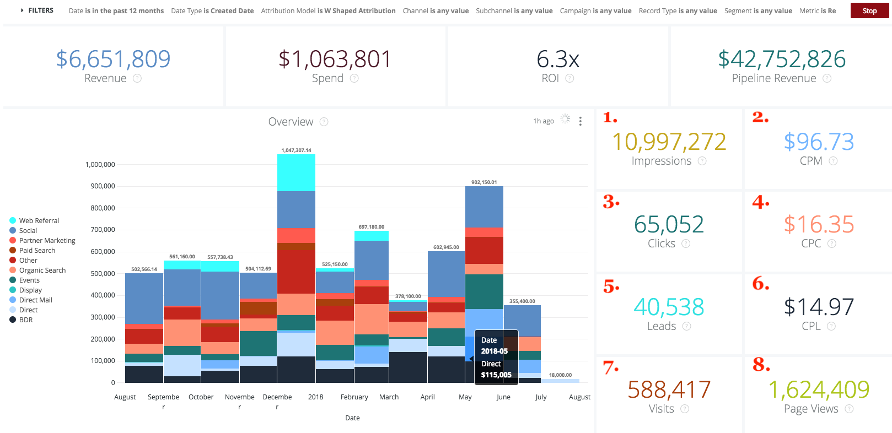

# Granska genomskärningar {#drill-throughs}

The [!DNL Marketo Measure Discover] upplevelsen gör det möjligt för kunderna att fördjupa sig i den datauppsättning som de bryr sig mest om. Om vissa åtgärder [!DNL Marketo Measure Discover], kan kunderna klicka i en ruta och utforska mer om mätvärdena.

Nedan finns en lista över kontrollpaneler och paneler som innehåller detaljförbättringar och den upplevelse som en användare kan förvänta sig när han eller hon bläddrar igenom. Tänk på att globala filter från kontrollpanelen kvarstår vid borrning genom.

## Översikt {#overview}

**Intäkter**

Definition: Total intäkt per månad via stapeldiagram och tabell. Därifrån kan man gå in i en månad eller bryta ut en månad för vecka, dag eller tid.

**Intäkter (diagram)**

Definition: Total intäkt per månad via stapeldiagram och tabell. Eftersom den överordnade rutan redan är ett stapeldiagram visas bara en månad vid detaljvisning.

_Detaljerad information: Total intäkt per månad fördelat på vecka eller datum._

**Utgift**

Definition: Total utgift per månad via stapeldiagram och tabell. Därifrån kan man gå in i en månad eller bryta ut en månad för vecka, dag eller tid.

**Erbjudanden**

Definition: Totalt antal erbjudanden per månad via stapeldiagram och tabell. Därifrån kan man gå in i en månad eller bryta ut en månad för vecka, dag eller tid.

**Försäljningsförlopp**

Definition: Total pipeline-intäkt per månad via stapeldiagram och tabell. Därifrån kan man gå in i en månad eller bryta ut en månad för vecka, dag eller tid.

**ROI - sammanfattning**

Definition: Total intäkt eller kostnad från varje kanal per månad via stapeldiagram och tabell. Därifrån kan du gå in på den raden en månad eller bryta ut en månad för vecka, dag eller tid.

**Kostnad per avtal**

Definition: Den totala utgiften dividerad med det totala antalet avtal, vilket ger den genomsnittliga kostnad som krävs för att förvärva en stängd vunnen affärsmöjlighet. Därifrån kan du gå in på den raden en månad eller bryta ut en månad för vecka, dag eller tid.

**Kanaler efter intäkt**

Definition: Total intäkt från varje kanal per månad via stapeldiagram och tabell. Därifrån kan du gå in på den raden en månad eller bryta ut en månad för vecka, dag eller tid.

**Delkanaler efter intäkt**

Definition: Total intäkt från varje delkanal per månad via stapeldiagram och tabell. Därifrån kan du gå in på den raden en månad eller bryta ut en månad för vecka, dag eller tid.

**Kampanjer efter intäkt**

Definition: Total intäkt från varje kampanj per månad via stapeldiagram och tabell. Därifrån kan du gå in på den raden en månad eller bryta ut en månad för vecka, dag eller tid.

**Avtalssammanfattning**

Definition: Totalt antal utgifter eller avtal från varje kanal per månad via stapeldiagram och tabell. Därifrån kan du gå in på den raden en månad eller bryta ut en månad för vecka, dag eller tid.

## Tillväxt {#growth}

**Total intäkt**

Definition: Total intäkt per månad via stapeldiagram och tabell. Därifrån kan man gå in i en månad eller bryta ut en månad för vecka, dag eller tid.

**Intäkter över tid**

Definition: Total intäkt per månad via stapeldiagram och tabell. Eftersom den överordnade rutan redan är ett diagram visas bara en månad vid detaljvisning.

_Total intäkt per månad uppdelad efter vecka eller datum._

**Totalt antal avtal**

Definition: Totalt antal erbjudanden per månad via stapeldiagram och tabell. Därifrån kan man gå in i en månad eller bryta ut en månad för vecka, dag eller tid.

**Erbjudanden över tid**

Definition: Totalt antal erbjudanden per månad via stapeldiagram och tabell. Eftersom den överordnade rutan redan är ett diagram visas bara en månad vid detaljvisning.

_Totalt antal avtal per månad, uppdelat efter vecka eller datum._

**Total omsättning för pipeline**

Definition: Total pipeline-intäkt per månad via stapeldiagram och tabell. Därifrån kan man gå in i en månad eller bryta ut en månad för vecka, dag eller tid.

**Pipeline-intäkter över tid**

Definition: Total pipeline-intäkt per månad via stapeldiagram och tabell. Eftersom den överordnade rutan redan är ett diagram visas bara en månad vid detaljvisning.

_Total försäljningsintäkt per månad fördelat på vecka eller datum._

**Totalt antal leads**

Definition: Totalt antal leads per månad via stapeldiagram och tabell. Därifrån kan man gå in i en månad eller bryta ut en månad för vecka, dag eller tid.

**Leads över tid**

Definition: Totalt antal leads per månad via stapeldiagram och tabell. Eftersom den överordnade rutan redan är ett diagram visas bara en månad vid detaljvisning.

_Totalt antal leads per månad uppdelat efter vecka eller datum._

**Totalt antal kontakter**

Definition: Totalt antal kontakter per månad via stapeldiagram och tabell. Därifrån kan man gå in i en månad eller bryta ut en månad för vecka, dag eller tid.

**Kontakter över tid**

Definition: Totalt antal kontakter per månad via stapeldiagram och tabell. Eftersom den överordnade rutan redan är ett diagram visas bara en månad vid detaljvisning.

_Totalt antal kontakter per månad uppdelat efter vecka eller datum._

**Totalt antal affärsmöjligheter**

Definition: Totalt antal affärsmöjligheter per månad via stapeldiagram och tabell. Därifrån kan man gå in i en månad eller bryta ut en månad för vecka, dag eller tid.

**Möjligheter över tid**

Definition: Totalt antal affärsmöjligheter per månad via stapeldiagram och tabell. Eftersom den överordnade rutan redan är ett diagram visas bara en månad vid detaljvisning.

_Totalt antal affärsmöjligheter per månad fördelat på vecka eller datum._

**Unika besök**

Definition: Totalt antal sidvisningar per månad via stapeldiagram och tabell. Därifrån kan man gå in i en månad eller bryta ut en månad för vecka, dag eller tid.

**Unika besök över tid**

Definition: Det totala antalet unika besök som visar trenden under en viss tidsperiod. Använd filtret Gruppera efter för att ändra stapeln efter kanal, delkanal, kampanj, konto, annonsgrupp, annons, annonsör, kreativt, nyckelord, placering och webbplats. Den här funktionen visas tom om den är inaktiverad.

**Besök**

Definition: Totalt antal platsbesök per månad via stapeldiagram och tabell. Därifrån kan man gå in i en månad eller bryta ut en månad för vecka, dag eller tid.

**Besök över tid**

Definition: Det totala antalet platsbesök som spåras visar trenden under en viss tidsperiod. Använd filtret Gruppera efter för att ändra stapeln efter kanal, delkanal, kampanj, konto, annonsgrupp, annons, annonsör, kreativt, nyckelord, placering och webbplats. Den här funktionen visas tom om den är inaktiverad.

**Forms**

Definition: Totalt antal inskickade formulär per månad via stapeldiagram och tabell. Därifrån kan man gå in i en månad eller bryta ut en månad för vecka, dag eller tid.

**Forms över tid**

Definition: Det totala antalet inlämnade formulär som visar trenden under en viss tidsperiod. Använd filtret Gruppera efter för att ändra stapeln efter kanal, delkanal, kampanj, konto, annonsgrupp, annons, annonsör, kreativt, nyckelord, placering och webbplats. Den här funktionen visas tom om den är inaktiverad.

## Utgift {#spend}

**Utgift**

Definition: Total utgift per månad via stapeldiagram och tabell. Därifrån kan man gå in i en månad eller bryta ut en månad för vecka, dag eller tid.

**Utgift (diagram)**

Definition: Total utgift per månad via stapeldiagram och tabell. Eftersom den överordnade rutan redan är ett diagram visas bara en månad vid detaljvisning.

_Total utgift per månad uppdelad efter vecka, datum eller tid. Det går att spendera sedan [!DNL Marketo Measure] laddar ned faktiska utgifter i minuten från våra annonsanslutningar._

**Utgift per kanal**

Definition: Total utgift från varje kanal per månad via stapeldiagram och tabell. Därifrån kan du gå in på den raden en månad eller bryta ut en månad för vecka, dag eller tid.

**Utgift per delkanal**

Definition: Total utgift från varje delkanal per månad via stapeldiagram och tabell. Därifrån kan du gå in på den raden en månad eller bryta ut en månad för vecka, dag eller tid.

**Utgifter per kampanj**

Definition: Total utgift från varje kampanj per månad via stapeldiagram och tabell. Därifrån kan du gå in på den raden en månad eller bryta ut en månad för vecka, dag eller tid.

## Försäljningshastighet {#sales-velocity}

**Hastighet (dagar)**

Definition: Det genomsnittliga antalet dagar som affärsmöjligheterna finns i säljcykeln, från den första anonyma kontakten till stängningen av affärsmöjligheten.

**Aktiva affärsmöjligheter**

Definition: Det totala antalet affärsmöjligheter från alla öppna affärsmöjligheter, vilket innebär att det inte är Closed Lost eller Closed Won.

**Avtalsstorlek**

Definition: Det genomsnittliga beloppet för en stängd Won-affärsmöjlighet.

**Vinst**

Definition: Det totala antalet stängda Won-möjligheter delat med det totala antalet stängda och avbrutna Von-möjligheter.

**Snabbhet för affärsmöjlighet efter kanal**

Definition: Det genomsnittliga antalet dagar som affärsmöjligheter finns i cykeln per fas, grupperat efter marknadsföringskanalen och med den tid det tar att gå vidare till nästa fas. De faser som visas här är milstolpe-stadier (FT, LC, OC) och anpassade stadier.

**Leadhastighet per kanal**

Definition: Genomsnittligt antal dagar som leads är i cykeln per fas innan de konverteras till en kontakt/möjlighet/belopp, grupperade efter marknadsföringskanalen och visar hur lång tid det tar att gå vidare till nästa fas. De faser som visas här är milstolpe-stadier (FT, LC) och anpassade stadier.

**Genomsnittlig snabbhet för affärsmöjlighet**

Definition: Det genomsnittliga antalet dagar som affärsmöjligheterna befinner sig i sin cykel per fas, vilket visar hur lång tid det tar att gå vidare till nästa fas. De faser som visas här är milstolpe-stadier (FT, LC, OC) och anpassade stadier. Siffrorna här visar tiden per fas i säljprojektshastigheten enligt kanaldiagrammet.

**Genomsnittlig ledhastighet**

Definition: Det genomsnittliga antalet dagar som leads är i cykeln per fas innan de konverteras till en kontakt/möjlighet/belopp, vilket visar hur lång tid det tar att gå vidare till nästa fas. De faser som visas här är milstolpe-stadier (FT, LC) och anpassade stadier. Siffrorna här återspeglar tiden per fas i kanaldiagrammet för lead-hastighet.

**Snabbhet för affärsmöjlighet över tid**

Definition: Det genomsnittliga antalet dagar som affärsmöjligheterna befinner sig i sin cykel per fas med en trend över tiden.

**Öka ledhastigheten över tid**

Definition: Det genomsnittliga antalet dagar som leads är i cykeln per fas med en trend över tid.

## Kontobaserad marknadsföring {#account-based-marketing}

**Total intäkt**

Definition: Total intäkt per månad via stapeldiagram och tabell. Därifrån kan man gå in i en månad eller bryta ut en månad för vecka, dag eller tid.

**Total omsättning för pipeline**

Definition: Total pipeline-intäkt per månad via stapeldiagram och tabell. Därifrån kan man gå in i en månad eller bryta ut en månad för vecka, dag eller tid.

**Matchade leads**

Definition: Totalt antal leads som matchats mot ett konto.

**Kontaktade konton**

Definition: Det totala antalet konton som har tagit emot någon kontaktyta.

**Affärsmöjligheter som berörts**

Definition: En lista över affärsmöjlighets-ID med motsvarande konto-ID

**Kontakter som berörts**

Definition: En lista med kontakt-ID:n med deras motsvarande konto-ID

**Pekpunkter över tid (diagram)**

Definition: En lista med kontaktytor från den valda månaden.

_Antalet berörda kontaktytor per vecka, datum eller tid._

**Konton som trycks över tid (diagram)**

Definition: En lista med konto-ID:n från den valda månaden.

_Antal konton som berörs uppdelat efter vecka, datum eller tid._

## Web Analytics {#web-analytics}

**Unika besök**

Definition: Totalt antal unika platsbesök per månad via stapeldiagram och tabell. Därifrån kan man gå in i en månad eller bryta ut en månad för vecka, dag eller tid.

**Kostnad per unikt besök**

Definition: Total utgift dividerad med totalt antal unika besök. Därifrån kan man gå in i en månad eller bryta ut en månad för vecka, dag eller tid.

**Unika besök per landningssida**

Definition: En lista med landningssidor baserad på antalet unika besökare från varje URL.

**Unika besök efter källa**

Definition: En vy av källorna till unika besökare på din webbplats.

**Unika besök över tid**

Definition: Det totala antalet unika besök som spåras, vilket visar en trend över en viss tidsram.

**Besök**

Definition: Totalt antal platsbesök per månad via stapeldiagram och tabell. Därifrån kan man gå in i en månad eller bryta ut en månad för vecka, dag eller tid.

**Kostnad per besök**

Definition: Den totala kostnaden dividerad med det totala antalet besök.

**Besök efter landningssida**

Definition: En lista över landningssidor baserad på antalet besök på varje URL.

**Besök efter källa**

Definition: Källa till besökare på din webbplats. Kan ändras av Channel, Subchannel, Campaign, Account, Ad Group, Ad, Advertiser, Creative, Keyword, Placement och Site.

**Besök över tid**

Definition: Det totala antalet besök som spåras, vilket visar trenden under en viss tidsram. Därifrån kan man gå in i en månad eller bryta ut en månad för vecka, dag eller tid.

**Sidvyer**

Definition: Totalt antal sidvisningar per månad via stapeldiagram och tabell. Därifrån kan man gå in i en månad eller bryta ut en månad för vecka, dag eller tid.

**Kostnad per sida**

Definition: Den totala utgiften dividerat med det totala antalet spårade sidvyer.

**Sidvisningar efter URL-adresser**

Definition: En lista med sidadresser som baseras på antalet sidvisningar från varje URL.

**Sidvisningar över tiden**

Definition: Totalt antal sidvisningar per månad via stapeldiagram och tabell. Eftersom den överordnade rutan redan är ett diagram visas bara en månad vid detaljvisning.

_Totalt antal sidvisningar per månad uppdelade efter vecka, datum eller tid._

**Forms Over Time**

Definition: Det totala antalet formulär som spåras, vilket visar trenden under en viss tidsram.

**Forms**

Definition: Totalt antal inskickade formulär per månad via stapeldiagram och tabell. Därifrån kan man gå in i en månad eller bryta ut en månad för vecka, dag eller tid.

**Kostnad per formulär**

Definition: De totala utgifterna dividerat med det totala antalet inlämnade formulär.

**Formulärinskickat efter formulär-URL**

Definition: En lista med formulär-URL:er baserat på det nummer som skickades på varje URL.

**Leads efter landningssida**

Definition: En lista över landningssidor baserad på antalet leads som genererats från varje landningssida.

**Leads efter formulär-URL**

Definition: En lista över formulär-URL:er baserat på antalet leads som genererades från varje URL.

## CMO {#cmo}

**Intäkter**

Definition: Total intäkt per månad via stapeldiagram och tabell. Därifrån kan man gå in i en månad eller bryta ut en månad för vecka, dag eller tid.

**Intäkter (diagram)**

Definition: Total intäkt per månad via stapeldiagram och tabell. Eftersom den överordnade rutan redan är ett stapeldiagram visas bara en månad vid detaljvisning.

_Total intäkt per månad uppdelad efter vecka eller datum._

**Utgift**

Definition: Total utgift per månad via stapeldiagram och tabell. Därifrån kan man gå in i en månad eller bryta ut en månad för vecka, dag eller tid.

**avkastning**

Definition: Den beräknade avkastningen på investeringen från de totala intäkterna och de totala utgifterna (baserat på attribueringsmodellen).

**Erbjudanden**

Definition: Totalt antal erbjudanden per månad via stapeldiagram och tabell. Därifrån kan man gå in i en månad eller bryta ut en månad för vecka, dag eller tid.

**Kostnad per avtal**

Definition: Totala utgifter dividerat med det totala antalet avtal, vilket ger den genomsnittliga kostnad det tar att förvärva en stängd vinstmöjlighet.

**Försäljningsförlopp**

Definition: Total pipeline-intäkt per månad via stapeldiagram och tabell. Därifrån kan man gå in i en månad eller bryta ut en månad för vecka, dag eller tid.

**Avtalsstorlek**

Definition: Det genomsnittliga beloppet för en stängd vunnen affärsmöjlighet.

**Kanaler efter intäkt**

Definition: Total intäkt från varje kanal per månad via stapeldiagram och tabell. Därifrån kan du gå in på den raden en månad eller bryta ut en månad för vecka, dag eller tid.

**Delkanaler efter intäkt**

Definition: Total intäkt från varje delkanal per månad via stapeldiagram och tabell. Därifrån kan du gå in på den raden en månad eller bryta ut en månad för vecka, dag eller tid.

**Kampanjer efter intäkt**

Definition: Total intäkt från varje kampanj per månad via stapeldiagram och tabell. Därifrån kan du gå in på den raden en månad eller bryta ut en månad för vecka, dag eller tid.

**ROI - sammanfattning**

Definition: Total intäkt eller kostnad från varje kanal per månad via stapeldiagram och tabell. Därifrån kan du gå in på den raden en månad eller bryta ut en månad för vecka, dag eller tid.

**Avtalssammanfattning**

Definition: Totalt antal utgifter eller avtal från varje kanal per månad via stapeldiagram och tabell. Därifrån kan du gå in på den raden en månad eller bryta ut en månad för vecka, dag eller tid.

## Innehållsmarknadsföring {#content-marketing}

**Total intäkt**

Definition: Total intäkt per månad via stapeldiagram och tabell. Därifrån kan man gå in i en månad eller bryta ut en månad för vecka, dag eller tid.

**Landningssidor per intäkt**

Definition: Totala intäkter från varje landningssida via liggande diagram och tabell. Därifrån kan du gå in på den raden en månad eller bryta ut en månad för vecka, dag eller tid.

**Total omsättning för pipeline**

Definition: Total pipeline-intäkt per månad via stapeldiagram och tabell. Därifrån kan man gå in i en månad eller bryta ut en månad för vecka, dag eller tid.

**Landningssidor per pipeline-intäkt**

Definition: Totala rörlighetsintäkter från varje landningssida via stapeldiagram och tabell. Därifrån kan du gå in på den raden en månad eller bryta ut en månad för vecka, dag eller tid.

**Totalt antal affärsmöjligheter**

Definition: Totalt antal affärsmöjligheter per månad via stapeldiagram och tabell. Därifrån kan man gå in i en månad eller bryta ut en månad för vecka, dag eller tid.

**Landningssidor efter antal affärsmöjligheter**

Definition: Totalt antal möjligheter från varje landningssida via stapeldiagram och tabell. Därifrån kan du gå in på den raden en månad eller bryta ut en månad för vecka, dag eller tid.

**Forms totalt**

Definition: Totalt antal formulär per månad via stapeldiagram och tabell. Därifrån kan man gå in i en månad eller bryta ut en månad för vecka, dag eller tid.

**Övre formulär-URL efter formulärinskickat material**

Definition: Totalt antal formulär från varje formulär-URL via stapeldiagram och tabell. Därifrån kan du gå in på den raden en månad eller bryta ut en månad för vecka, dag eller tid.

**Formulär-URL:er efter kanal**

Definition: Totalt antal formulär som skickats från formulärets URL per månad via stapeldiagram och tabell. Därifrån kan du gå in på den raden en månad eller bryta ut en månad för vecka, dag eller tid.

**Unika besök**

Definition: Det totala antalet unika webbplatsbesök som spåras för alla kända och anonyma besökare. Gå in och se de unika webbplatsbesöken spåras per månad.

**De vanligaste landningssidorna efter unika besök**

Definition: En lista över landningssidor baserad på antalet unika besök på varje landningssida. Granska in för att se de unika besöken per månad till den valda URL:en.

**Besök**

Definition: Det totala antalet webbplatsbesök som spåras för alla kända och anonyma besökare. Granska dig för att se webbplatsbesöken spåras per månad.

**De vanligaste landningssidorna efter besök**

Definition: En förteckning över landningssidor baserad på antalet inledande besök på varje landningssida. Granska in för att se besök per månad till den valda URL:en.

**Totalt antal leads**

Definition: Totalt antal leads per månad via stapeldiagram och tabell. Därifrån kan man gå in i en månad eller bryta ut en månad för vecka, dag eller tid.

**Landningssidor efter antal leads**

Definition: Totalt antal leads från varje landningssida via stapeldiagram och tabell. Därifrån kan du gå in på den raden en månad eller bryta ut en månad för vecka, dag eller tid.

## Betalda media {#paid-media}

**Impressions**

Definition: Totalt antal visningar per månad via stapeldiagram och tabell. Därifrån kan man gå in i en månad eller bryta ut en månad för vecka, dag eller tid.

**CPM**

Definition: De totala utgifterna från de serverade avbildningarna dividerat med det totala antalet visningar.

**Klickningar**

Definition: Totalt antal klick per månad via stapeldiagram och tabell. Därifrån kan man gå in i en månad eller bryta ut en månad för vecka, dag eller tid.

**CPC**

Definition: Den totala kostnaden från de spårade klippen dividerat med det totala antalet klick.

**Leads**

Definition: Totalt antal leads baserat på attribueringsmodellen.

**CPL**

Definition: Den totala utgiften från de leads som skapas dividerat med det totala antalet klick, vilket ger CPL-frekvensen.

**Besök**

Definition: Totalt antal platsbesök per månad via stapeldiagram och tabell. Därifrån kan man gå in i en månad eller bryta ut en månad för vecka, dag eller tid.

**Sidvyer**

Definition: Totalt antal sidvisningar per månad via stapeldiagram och tabell. Därifrån kan man gå in i en månad eller bryta ut en månad för vecka, dag eller tid.

**Kampanjsammanfattning**

Definition: En lista över kampanjer som baseras på hur mycket intäkter/utgifter/erbjudanden/möjligheter som tillskrevs för varje kampanj, sorterat efter den högsta baserat på den valda attribueringsmodellen.

**Annonssammanfattning**

Definition: En lista med annonser som baseras på hur mycket intäkter/försäljningsintäkter/försäljningsintäkter/försäljningstillfällen/affärsmöjligheter som tillskrevs varje annons, baserat på den valda attribueringsmodellen.

**Nyckelordssammanfattning**

Definition: En lista med nyckelord baserad på hur mycket intäkter/försäljningsintäkter/försäljningsintäkter/investeringar/affärsmöjligheter som tillskrevs varje nyckelord, baserat på den valda attribueringsmodellen.

**Kampanjer efter avkastning**

Definition: En lista med kampanjer baserade på beräknad avkastning för varje kampanj, sorterad efter högsta avkastning på investering. Detaljgranska om du vill se intäkter eller utgifter per månad för den valda kampanjen.

**Annonser efter ROI**

Definition: En lista med annonser som baseras på beräknad avkastning för varje annons, sorterad efter högsta avkastning. Gå in och se intäkterna eller utgifterna per månad för den valda annonsen.

**Nyckelord efter ROI**

Definition: En lista med nyckelord baserat på beräknad avkastning för varje nyckelord, sorterat efter högsta avkastning. Gå in och se intäkter eller utgifter per månad för det valda nyckelordet.
