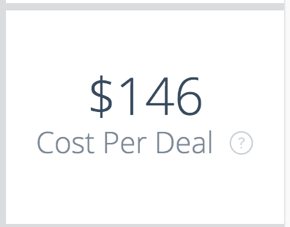

# Översikt över paneler {#overview-board-tiles}

Översiktspanelen ger en mer heltäckande bild av ert marknadsföringsresultat och hjälper marknadsföringsteamen att fatta rätt beslut när de ökar ert team, er budget eller era intäkter.

<table> 
 <colgroup> 
  <col> 
  <col> 
  <col> 
  <col> 
  <col> 
  <col> 
  <col> 
  <col> 
  <col> 
  <col> 
  <col> 
 </colgroup> 
 <tbody> 
  <tr> 
   <td> </td> 
   <td>
<strong>Datumtyp</strong>
</td> 
   <td>
<strong>Datum</strong>
</td> 
   <td>
<strong>Attributionsmodell</strong>
</td> 
   <td>
<strong>Mått</strong>
</td> 
   <td>
<strong>Dimension</strong>
</td> 
   <td>
<strong>Kanal</strong>
</td> 
   <td>
<strong>Delkanal</strong>
</td> 
   <td>
<strong>Campaign</strong>
</td> 
   <td>
<strong>ID för annonskonto</strong>
</td> 
   <td>
<strong>CRM-kontonamn</strong>
</td> 
  </tr> 
  <tr> 
   <td>
<strong>Intäkter</strong>
</td> 
   <td><strong>X</strong></td> 
   <td><strong>X</strong></td> 
   <td><strong>X</strong></td> 
   <td> </td> 
   <td> </td> 
   <td><strong>X</strong></td> 
   <td><strong>X</strong></td> 
   <td><strong>X</strong></td> 
   <td><strong>X</strong></td> 
   <td><strong>X</strong></td> 
  </tr> 
  <tr> 
   <td>
<strong>Översikt</strong>
</td> 
   <td><strong>X</strong></td> 
   <td><strong>X</strong></td> 
   <td><strong>X</strong></td> 
   <td><strong>X</strong></td> 
   <td><strong>X</strong></td> 
   <td><strong>X</strong></td> 
   <td><strong>X</strong></td> 
   <td><strong>X</strong></td> 
   <td><strong>X</strong></td> 
   <td><strong>X</strong></td> 
  </tr> 
  <tr> 
   <td>
<strong>Utgift</strong>
</td> 
   <td> </td> 
   <td><strong>X</strong></td> 
   <td> </td> 
   <td> </td> 
   <td> </td> 
   <td><strong>X</strong></td> 
   <td><strong>X</strong></td> 
   <td><strong>X</strong></td> 
   <td><strong>X</strong></td> 
   <td> </td> 
  </tr> 
  <tr> 
   <td>
<strong>avkastning</strong>
</td> 
   <td><strong>X</strong></td> 
   <td><strong>X</strong></td> 
   <td><strong>X</strong></td> 
   <td> </td> 
   <td> </td> 
   <td><strong>X</strong></td> 
   <td><strong>X</strong></td> 
   <td><strong>X</strong></td> 
   <td><strong>X</strong></td> 
   <td><strong>X</strong></td> 
  </tr> 
  <tr> 
   <td>
<strong>Erbjudanden</strong>
</td> 
   <td><strong>X</strong></td> 
   <td><strong>X</strong></td> 
   <td><strong>X</strong></td> 
   <td> </td> 
   <td> </td> 
   <td><strong>X</strong></td> 
   <td><strong>X</strong></td> 
   <td><strong>X</strong></td> 
   <td><strong>X</strong></td> 
   <td><strong>X</strong></td> 
  </tr> 
  <tr> 
   <td>
<strong>Kostnad per avtal</strong>
</td> 
   <td><strong>X</strong></td> 
   <td><strong>X</strong></td> 
   <td><strong>X</strong></td> 
   <td> </td> 
   <td> </td> 
   <td><strong>X</strong></td> 
   <td><strong>X</strong></td> 
   <td><strong>X</strong></td> 
   <td><strong>X</strong></td> 
   <td><strong>X</strong></td> 
  </tr> 
  <tr> 
   <td>
<strong>Försäljningsförlopp</strong>
</td> 
   <td><strong>X</strong></td> 
   <td><strong>X</strong></td> 
   <td><strong>X</strong></td> 
   <td> </td> 
   <td> </td> 
   <td><strong>X</strong></td> 
   <td><strong>X</strong></td> 
   <td><strong>X</strong></td> 
   <td><strong>X</strong></td> 
   <td><strong>X</strong></td> 
  </tr> 
  <tr> 
   <td>
<strong>Avtalsstorlek</strong>
</td> 
   <td><strong>X</strong></td> 
   <td><strong>X</strong></td> 
   <td><strong>X</strong></td> 
   <td> </td> 
   <td> </td> 
   <td><strong>X</strong></td> 
   <td><strong>X</strong></td> 
   <td><strong>X</strong></td> 
   <td><strong>X</strong></td> 
   <td><strong>X</strong></td> 
  </tr> 
  <tr> 
   <td>
<strong>Kanalsammanfattning</strong>
</td> 
   <td><strong>X</strong></td> 
   <td><strong>X</strong></td> 
   <td><strong>X</strong></td> 
   <td><strong>X</strong></td> 
   <td> </td> 
   <td><strong>X</strong></td> 
   <td><strong>X</strong></td> 
   <td><strong>X</strong></td> 
   <td><strong>X</strong></td> 
   <td><strong>X</strong></td> 
  </tr> 
  <tr> 
   <td>
<strong>Sammanfattning av delkanal</strong>
</td> 
   <td><strong>X</strong></td> 
   <td><strong>X</strong></td> 
   <td><strong>X</strong></td> 
   <td><strong>X</strong></td> 
   <td> </td> 
   <td><strong>X</strong></td> 
   <td><strong>X</strong></td> 
   <td><strong>X</strong></td> 
   <td><strong>X</strong></td> 
   <td><strong>X</strong></td> 
  </tr> 
  <tr> 
   <td>
<strong>Kampanjsammanfattning</strong>
</td> 
   <td><strong>X</strong></td> 
   <td><strong>X</strong></td> 
   <td><strong>X</strong></td> 
   <td><strong>X</strong></td> 
   <td> </td> 
   <td><strong>X</strong></td> 
   <td><strong>X</strong></td> 
   <td><strong>X</strong></td> 
   <td><strong>X</strong></td> 
   <td><strong>X</strong></td> 
  </tr> 
  <tr> 
   <td>
<strong>avkastning</strong>
</td> 
   <td><strong>X</strong></td> 
   <td><strong>X</strong></td> 
   <td><strong>X</strong></td> 
   <td> </td> 
   <td><strong>X</strong></td> 
   <td><strong>X</strong></td> 
   <td><strong>X</strong></td> 
   <td><strong>X</strong></td> 
   <td><strong>X</strong></td> 
   <td><strong>X</strong></td> 
  </tr> 
  <tr> 
   <td>
<strong>ROI - sammanfattning</strong>
</td> 
   <td><strong>X</strong></td> 
   <td><strong>X</strong></td> 
   <td><strong>X</strong></td> 
   <td> </td> 
   <td><strong>X</strong></td> 
   <td><strong>X</strong></td> 
   <td><strong>X</strong></td> 
   <td><strong>X</strong></td> 
   <td><strong>X</strong></td> 
   <td><strong>X</strong></td> 
  </tr> 
 </tbody> 
</table>

## Intäktsruta {#revenue-tile}

Totala intäkt från Closed Won-möjligheter baserat på attribueringsmodell.

-Information om affärsmöjlighet: Visar en uppdelning av relaterade affärsmöjlighets-ID, Skapat den, Stängningsdatum, ISO-kod och Intäktsattribut.\
-Show Details: En uppdelning per månad.

## Översikt (diagram) Sida vid sida {#overview-chart-tile}

Diagrammet visar intäkter som tillskrivs varje kanal och som visas över tid.

-Information om affärsmöjlighet: Visar en uppdelning av relaterade affärsmöjlighets-ID, Skapat den, Stängningsdatum, ISO-kod och Intäktsattribut.\
-Visar en beskrivning av de medverkande Opp-ID:n:

* Efter ROI Week
* Efter ROI-data
* Efter ROI-timme
* Efter ROI Minut
* Efter ROI Time

## Utgiftsruta {#spend-tile}

Det totala utgiftsbeloppet för både API-kostnader och självrapporterade kostnader för den angivna tidsperioden.

>[!NOTE]
>
>Vid borrning på mindre än en månad, [!DNL Marketo Measure] kommer att beräkna medelvärdet av utgifterna för den månaden och fördela medelvärdet till varje dag.

-Utgiftsinformation: Visar en beskrivning av det relaterade unika ID:t för utgiftskampanj, kampanjnamn, kanal, delkanal, datum, ursprunglig valuta, Utgift.  -Show Details: En uppdelning per månad.

## ROI-platta {#roi-tile}

Den beräknade avkastningen (avkastning på investering) från den totala intäkten (från den valda attribueringsmodellen) och de totala utgifterna (intäktsbricka = avkastningsnivå = avkastningsnivå).

## Ruta för erbjudanden {#deals-tile}

Visar det totala antalet tilldelade erbjudanden (erbjudanden är ett antal stängda vinstmöjligheter).

>[!NOTE]
>
>Om datumtypen &quot;Kontaktpunktsdatum&quot; är markerad går det att göra partiella räkningar eftersom det kan finnas vissa kontaktytor som inte ligger inom tidsintervallet.

-Information om affärsmöjlighet: Visar en beskrivning av relaterade ID:n för affärsmöjlighet, Skapat den, Stängningsdatum och Attribution (antal).  -Show Details: En uppdelning per månad.

## Kostnad per avtalsruta {#cost-per-deal-tile}

Genomsnittlig kostnad som krävs för att förvärva en stängd vunnen affärsmöjlighet. Den totala kostnaden dividerat med det totala antalet avtal (Spend Tile = Deals Tile = Cost Per Deal Tile).

## Inkomstpanel för pipeline {#pipeline-revenue-tile}

Den totala potentiella intäkten för öppna affärsmöjligheter

>[!NOTE]
>
>Intäkterna återspeglas för den angivna attribueringsmodellen.

-Information om affärsmöjlighet: Visar en uppdelning av relaterade affärsmöjlighets-ID, Skapat den, Stängningsdatum, ISO-kod och Intäktsattribut.  -Show Details: En uppdelning per månad.

## Ruta för avtalsstorlek {#deal-size-tile}

Genomsnittlig intäkt för stängda vinstmöjligheter (intäktsbricka = avtalsruta = avtalsstorleksbricka).

## Panelen Kanalsammanfattning {#channel-summary-tile}

Visa en lista över kanaler baserat på valda mätvärden (intäkter, pipeline-intäkter, utgifter, erbjudanden, möjligheter, leads, kontakter).

## Sammanfattningsruta för delkanal {#subchannel-summary-tile}

Visa en lista över delkanaler baserat på valda mätvärden (intäkter, pipeline-intäkter, utgifter, erbjudanden, affärsmöjligheter, leads, kontakter).

## Kampanjsammanfattningsruta {#campaign-summary-tile}

Visa en lista över kampanjer baserat på valda mätvärden (intäkter, försäljningsintäkter, utgifter, affärer, affärsmöjligheter, leads, kontakter).

## ROI-ruta (diagram) {#roi-chart-tile}

Visar den avkastning som tilldelats det valda måttet (kanal, delkanal, kampanj, konto, adgroup, annons, annonsör, kreativt nyckelord, placering, plats) baserat på den valda attribueringsmodellen.

## Översikt över avkastning {#roi-summary-tile}

Visar den avkastning som tilldelats det valda måttet (kanal, delkanal, kampanj, konto, adgroup, annons, annonsör, kreativt nyckelord, placering, plats) baserat på den valda attribueringsmodellen.

-Information om affärsmöjlighet: Visar en beskrivning av relaterade ID:n för affärsmöjlighet, Skapat den, Stängningsdatum och Attribution (antal).

-Show Details: En uppdelning per månad.
