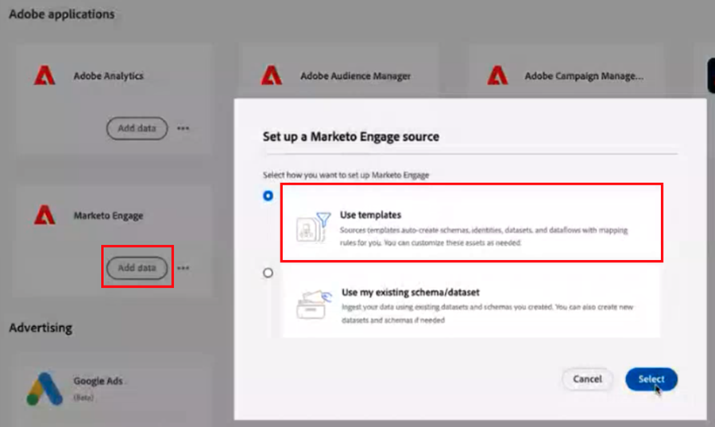

# [!DNL Marketo Measure] Ultimate Implementation Guide {#marketo-measure-ultimate-implementation-guide}

Den här artikeln är en implementeringshandbok för Marketo Measure Ultimate som innehåller tydliga steg och insikter för att säkerställa en lyckad integrering och användning.

## De viktigaste skillnaderna när Ultimate används jämfört med standardnivåer {#main-differences-when-using-ultimate-over-standard-tiers}

Importera B2B-data via AEP: Marknadsförarna förväntas hämta B2B-data (t.ex. konto, säljprojekt, kontakt, lead, kampanj, kampanjmedlem, aktivitet) via AEP. Hämta in alla data för attribuering genom att hämta in data från i stort sett vilken datakälla som helst och från flera datakällor av samma typ.

* Använd med nästan alla CRM-system, inte bara Salesforce och Dynamics.
* Koppla ihop flera CRM-instanser och/eller MAP-instanser till en Marketo Measure-instans.
* Hämta in registrerings- och deltagardata för webbinarium från tredje part.

Anslutningarna för direkt CRM och Marketo Engage är inte längre tillgängliga för Ultimate.

* Ultimate skickar inte tillbaka data till CRM. Kunder kan förbruka data från datalagret.
* Marknadsförarna kommer att fortsätta att föra in Ad Platform-data via direkta anslutningar och spåra webbaktiviteter via Marketo Measure javascript.

De ultimata användarna kommer att etableras som AEP. Om de redan har AEP kommer vi inte att ometablera en ny instans.

* Den tilldelade AEP-versionen kommer att innehålla alla källanslutningar, schemadatamodellering, datauppsättningar, ad hoc-frågetjänst och endast en destination för Marketo Measure.

Läs mer om [Marketo Measure Ultimate](/help/marketo-measure-ultimate/marketo-measure-ultimate-overview.md){target="_blank"}.

## Scheman och datauppsättningar {#schemas-and-datasets}

>[!NOTE]
>
>Checka ut [Byggblock i ett schema](https://experienceleague.adobe.com/docs/experience-platform/xdm/schema/composition.html?lang=en#building-blocks-of-a-schema){target="_blank"} för en översikt över scheman, klasser och fältgrupper.

**XDM-schema = klass + schemafältgrupp&#42;**

* Obligatoriska fält kan inte ändras. Kunderna kan skapa och lägga till anpassade fält efter behov.
* Exempel på fältnamn baserat på hierarki: accountOrganization.annualRevenue.amount

&#42; _Ett schema består av en klass och noll eller flera schemafältgrupper. Det innebär att du kan skapa ett datauppsättningsschema utan att använda fältgrupper._

[Datauppsättningar - översikt](https://experienceleague.adobe.com/docs/experience-platform/catalog/datasets/overview.html){target="_blank"}: Alla data som har importerats till AEP lagras i Data Lake som datauppsättningar. En datauppsättning är en lagrings- och hanteringskonstruktion för en datamängd, vanligtvis en tabell, som innehåller ett schema (kolumner) och fält (rader).

## Skapa ett schema {#creating-a-schema}

Vi rekommenderar att du använder ett autogenereringsverktyg för att skapa 10 standardscheman för B2B.

* Steg för att hämta och konfigurera verktyget [finns här](https://experienceleague.adobe.com/docs/experience-platform/sources/connectors/adobe-applications/marketo/marketo-namespaces.html#set-up-b2b-namespaces-and-schema-auto-generation-utility){target="_blank"}.

För dem som har _**CDP-berättigande**_: Skapa scheman genom att gå till sidan Källor.

* Välj Lägg till data > Använd mallar från en källa

* Välj ett konto och alla B2B-mallar för att skapa 10 standardscheman för B2B.

## Dataflöden {#dataflows}

[Översikt över dataflöden](https://experienceleague.adobe.com/docs/experience-platform/dataflows/home.html){target="_blank"}

**Steg för att skapa ett dataflöde:**

1. Välj en källa.
1. Välj ett befintligt konto eller skapa ett konto.
1. Välj en datatyp i listan med tillgängliga typer att importera från källan.
1. Välj en befintlig datauppsättning eller skapa en ny datauppsättning.
1. Mappa fälten från källan till schemat.

   >[!NOTE]
   >
   >* Om du mappar en schematyp till en annan, kommer den att göras automatiskt.
   >* Du kan också importera mappning från ett annat flöde i systemet.
   >* Du kan mappa ett källfält till flera målfält, men inte tvärtom.
   >* Du kan skapa beräkningsfält ([Funktioner för datapersonmappning](https://experienceleague.adobe.com/docs/experience-platform/data-prep/functions.html){target="_blank"}).

   >[!CAUTION]
   >
   >* Du kan redigera ett dataflöde, men data fylls inte i i efterhand när en mappning ändras.
   >* Om ett obligatoriskt fält är NULL, kommer hela flödet att avvisas.

   >[!NOTE]
   >
   >[Marketo Measure Ultimate Data Integrity-krav](/help/marketo-measure-ultimate/data-integrity-requirement.md){target="_blank"}

1. Ange en datainläsningskadens.
1. Granska och slutför.
1. Gå till sidan Kontostatus i Inställningar för måttanvändargränssnitt för dataflödesstatus.

**Övervakning:**

Källor > Dataflöden för att kontrollera dataflödenas status

* Om du vill visa aktivitetsinformation för en datauppsättning klickar du bara på datauppsättningen.
* Om du vill visa dataflödesfel markerar du ett dataflöde, väljer ett dataflöde och klickar på Förhandsgranska feldiagnostik.

## Datainspektion {#data-inspection}

Alternativ 1: Om du vill köra frågor direkt från användargränssnittet går du till fliken Frågor under Datahantering.

Alternativ 2: [Hämta och använda PSQL](https://experienceleague.adobe.com/docs/experience-platform/query/clients/psql.html){target="_blank"} (snabbare och tillförlitligare).

## Aktivera datauppsättning för Marketo Measure {#activate-dataset-for-marketo-measure}

Gå till avsnittet Experience Platform > Mappning av sandlådor i inställningarna för Mät-användargränssnittet och mappa en sandlåda innan du börjar.

>[!CAUTION]
>
>Det här kan inte ändras när du väl har valt det.

1. I AEP går du till Destinationer > Marketo Measure-sida för att exportera datauppsättningar.
1. Konfigurera mål.
1. Aktivera datauppsättning.
1. Gå till sidan Kontostatus i Inställningar för måttanvändargränssnitt för dataflödesstatus.

>[!NOTE]
>
>* Data för en viss enhet (t.ex. Konto) från en viss källa kan bara placeras i en datauppsättning. Varje datauppsättning kan bara inkluderas i ett dataflöde. Överträdelser kommer att stoppa dataflödet vid körning.
>* Ta bort hela målet i AEP för att ta bort data i Mått. Om du inaktiverar avbryts bara ny dataexport och gamla data behålls.
>* Måttkonfigurationen ser oftast likadan ut, men vissa delar, som Stage Mapping, ser annorlunda ut.
>* Det tar några timmar för ett nytt dataflöde att generera en flödeskörning och sedan inträffar de med regelbundna timintervall.

I Mätvärdet måste standardvalutan anges i avsnittet Valuta

* Om du använder flera valutor måste valutakonverteringsschemat fyllas i i AEP för att vi ska kunna läsa och använda för konverteringar.

**Scenmappning:**

Vi importerar inte automatiskt faser från användardata, så alla faser måste mappas manuellt.

* Användare kan mappa faser från olika källor.

Om faserna inte mappas kommer systemet inte att fungera eftersom det inte kommer att finnas någon plats för data.

**Regler för kampanjmedlemmar:**

Du måste välja en datauppsättning och ange regler för varje datauppsättning.

**Regler för upplevelsehändelser:**

Behöver välja en datauppsättning och välja aktivitetstyper.

* Anpassade aktiviteter stöds inte ännu.
* Om kunden har aktiviteter som inte passar de tillgängliga alternativen föreslår vi att de kategoriseras som&quot;Intressanta stunder&quot; och att anpassade fält används för att skilja dem åt.

**Offlinekanaler:**

* Vi gör inte datauppsättningsspecifika kanalmappningsregler, så det skulle vara globalt.
* Vi måste matcha både CRM Campaign-typen och Channel till slut, men för närvarande kan vi mappa kanalnamnet till båda fälten som en tillfällig lösning.
* **Kanalregler: Data som inte har fyllts i har inga scenövergångsdata.**

Inställningarna för slutpunkt och segment ändras inte.
