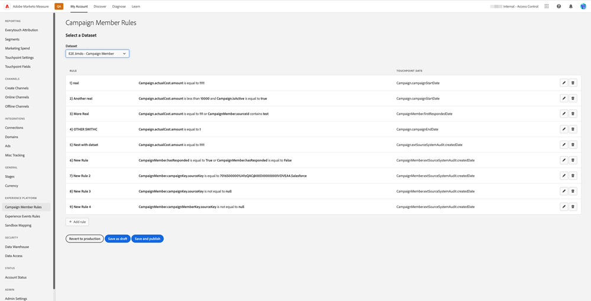

# [!DNL Marketo Measure] Ultimate Overview {#marketo-measure-ultimate-overview}

[!DNL Marketo Measure] (tidigare Bizible) ger marknadsförarna insikt i vilka marknadsföringssatsningar som är mest effektiva när det gäller att öka intäkterna och maximera avkastningen på investeringen för deras företag. [!DNL Marketo Measure] är en marknadsföringsattribueringslösning som automatiskt spårar och rapporterar kanalernas prestanda, vilket ger synlighet i vilka kanaler som ökar kundengagemanget och gör att ni kan optimera era era marknadsföringsutgifter i enlighet med detta.

[!DNL Marketo Measure Ultimate] innehåller ytterligare funktioner:

* Hämta in alla data för attribuering genom att hämta in data från nästan vilken datakälla som helst och från flera datakällor av samma typ.
   * Använd med nästan alla CRM-system, inte bara Salesforce och Dynamics.
   * Anslut flera CRM-instanser och/eller MAP-instanser till en [!DNL Marketo Measure]-instans.
   * Hämta in registrerings- och deltagardata för webbinarium från tredje part.

* Omvandla era data mycket flexibelt med hjälp av fältmappning och omvandlingsfunktioner för att säkerställa rätt dataform.

* Gör attribueringsinsikter tillgängliga för externa program via det medföljande datalagret för att integrera insikterna i arbetsflödet. Mer detaljerade resultatdata och BI-baserad rapportering, inklusive Snowflake Data Warehouse, som ger tillgång till detaljerade resultatdata och möjlighet att använda alla BI-verktyg för analys och rapportering.

* Integrering med RTCDP (B2B eller B2P Edition), som ger en integrerad B2B-attribueringslösning för RTCDP-kunder som RTCDP och [!DNL Marketo Measure] fungerar båda från centraliserade Adobe Experience Platform-data (AEP).

**[!DNL Marketo Measure]Tiers 1-3**

**[!DNL Marketo Measure Ultimate]**

## Nyheter i [!DNL Marketo Measure Ultimate] {#whats-new-in-marketo-measure-ultimate}

**Importera B2B-data via AEP**

Marknadsförarna förväntas hämta sina B2B-data (t.ex. konto, säljprojekt, kontakt, lead, kampanj, kampanjmedlem, aktivitet) via AEP. Anslutningarna för direkt CRM och Marketo Engage är inte längre tillgängliga för Ultimate. Marknadsförarna fortsätter att föra över Ad Platform-data via direkta anslutningar och spåra webbaktiviteter via [!DNL Marketo Measure] javascript.

**Standardinställning för valuta**

[!DNL Marketo Measure Ultimate] anger standardvalutan till USD tills användaren ändrar den. Om du anger en ny standardvaluta uppdateras data utan ombearbetning. Så länge den valda valutan finns som mål-ISO-kod behöver du inte skicka konverteringsgrader.

**[!DNL Marketo Measure Ultimate]Sandbox**

[!DNL Marketo Measure Ultimate]-instansen måste mappas till en AEP-sandlåda innan [!DNL Marketo Measure]-måldataflödena i AEP kan skapas.

>[!NOTE]
>
>En [!DNL Marketo Measure Ultimate]-produktionsinstans måste mappas till en AEP-produktionssandlåda. En [!DNL Marketo Measure Ultimate]-utvecklarinstans måste mappas till en AEP-utvecklarsandlåda.

När markeringen för sandlådemappning har sparats kan du inte ändra den i programmet. Om du vill ändra den kontaktar du [Marketo Support](https://nation.marketo.com/t5/support/ct-p/Support){target="_blank"}.

Data för en given entitet (till exempel Konto) från en viss datakälla kan bara gå till en datamängd. Varje datauppsättning kan bara inkluderas i ett dataflöde. Överträdelser stoppar dataflödet vid körning.

**Stage Mapping**

Alla [!DNL Marketo Measure Ultimate]-regler är datauppsättningsspecifika. Regler för Stage Mapping måste skapas för alla datamängder och alla markerade steg.

Det finns sex inbyggda faser:

* Lead förlorad
* Öppna lead
* Konverterad lead
* Förlorade affärsmöjligheter
* Öppen affärsmöjlighet
* Vunnen affärsmöjlighet

Avsnitten Förlorad, Vunn och Konverterad tillåter inte anpassade stadier. Source-data kan dock mappas till de inbyggda faserna Förlorad/Vunnen/Konverterad genom att mappningsregeln uppdateras.

Anpassade steg kan bara definieras för Öppna-avsnitt.
CRM-faser inkluderas inte längre automatiskt i scenmappningen.

Fyra inbyggda steg måste mappas med regler (mappningsregler för de andra två, Lead Lost och Lead Converted, är valfria):

* Öppna lead
* Förlorade affärsmöjligheter
* Öppen affärsmöjlighet
* Vunnen affärsmöjlighet

Regelvillkoren är datauppsättningsspecifika. Stage Mapping-regler måste skapas för alla datauppsättningar och alla faser utom Lead Lost och Lead Converted.

Ingen markering för tratt jämfört med boomerang jämfört med anpassad modell. Alla faser markeras för tratt, boomerang och anpassad modell. Det finns en gräns för hur många steg vi stöder: 15 anpassade plus 6 inbyggda steg.

Kontaktpunktsregler för kampanjmedlemmar och Touchpoint-regler för aktivitet är datauppsättningsspecifika.

Attribution Touchpoints skrivs inte till CRM eftersom Ultimate inte har någon direkt CRM-anslutning.

[!DNL Marketo Measure] ABM ML-tjänster (Lead-to-Account Matching och Predictive Engagement Score) är inte tillgängliga för [!DNL Marketo Measure Ultimate]. Dessa tjänster ingår kostnadsfritt i RT-CDP B2B Edition.

## Begränsningar {#limitations}

* Begränsade fält är tillgängliga för dataomvandlingsregler.
* Det finns ingen migreringsväg för befintliga Tier 1/2/3-användare. Kräver en ny implementering, men vi hjälper dig att migrera spårade webbaktivitetsdata från den befintliga instansen.

>[!MORELIKETHIS]
>
>[Marketo Measure Ultimate Destination](https://experienceleague.adobe.com/docs/experience-platform/destinations/catalog/adobe/marketo-measure-ultimate.html?lang=en){target="_blank"}
